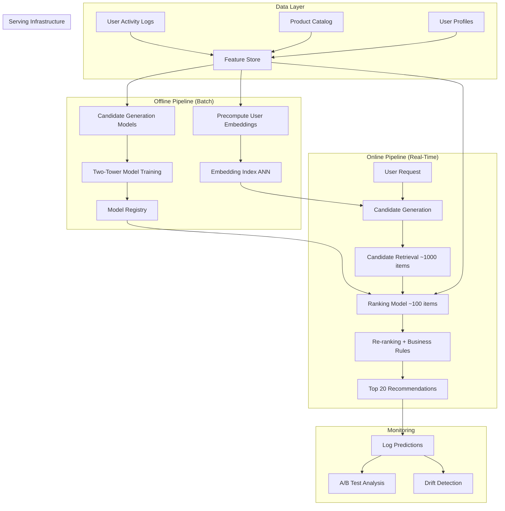

# Case Study 1: Product Recommendation System

> "Design a product recommendation system for an e-commerce platform like Amazon."
> — Asked at: Meta, Pinterest, Amazon, Netflix, Spotify

---

## Step 1: Problem Definition + Clarifying Questions

### What are we building?

A system that recommends products to users on an e-commerce platform. The recommendations appear on the homepage ("Recommended for You"), product detail pages ("Customers Also Bought"), and in emails.

### Clarifying questions to ask the interviewer

1. **Scale**: How many users and products? → Assume 100M users, 10M products
2. **Latency**: What is the acceptable response time? → Under 200ms for page load
3. **Context**: Are we recommending on homepage (broad) or product page (similar items)? → Both, but focus on homepage first
4. **Cold start**: How do we handle new users with no history? → Important, need a solution
5. **Real-time vs batch**: Do recommendations need to update in real-time (e.g., after a purchase) or can they be precomputed? → Hybrid: batch for most, real-time for recent actions
6. **Business constraints**: Any diversity or freshness requirements? → Yes, avoid recommending the same category repeatedly

### ML Problem Formulation

This is a **ranking problem**. Given a user, rank all products by predicted relevance. The system predicts: "What is the probability this user will engage with (click, add to cart, purchase) this product?"

---

## Step 2: Metrics

### Offline Metrics (measured during development)

| Metric | What It Measures | Target |
|--------|-----------------|--------|
| **Recall@K** | Of all relevant items, how many are in the top K recommendations? | > 0.30 at K=50 |
| **NDCG@K** | Are the most relevant items ranked highest? (position-aware) | > 0.25 at K=20 |
| **Hit Rate@K** | Does the top K list contain at least one item the user engaged with? | > 0.60 at K=10 |
| **AUC-ROC** | How well does the ranking model separate positive from negative items? | > 0.80 |
| **Coverage** | What percentage of the product catalog gets recommended to at least one user? | > 40% |

### Online Metrics (measured in production via A/B test)

| Metric | What It Measures | Why It Matters |
|--------|-----------------|----------------|
| **Click-Through Rate (CTR)** | % of recommendations that get clicked | Direct engagement signal |
| **Conversion Rate** | % of recommendations that lead to purchase | Revenue impact |
| **Revenue Per User** | Average revenue generated per user from recommendations | Business value |
| **Session Duration** | Time spent browsing after seeing recommendations | Engagement depth |
| **Diversity Score** | Average pairwise distance between recommended items | Avoid filter bubbles |

### Guardrail Metrics (must not degrade)

- Overall site revenue
- User retention rate (7-day, 30-day)
- Cart abandonment rate

---

## Step 3: High-Level Architecture

### Why a two-stage architecture?

Ranking 10M products per request is computationally impossible within 200ms. The solution is a funnel:

1. **Candidate Generation** (fast, approximate): Reduce 10M products to ~1,000 candidates using cheap models (embedding similarity, collaborative filtering). Speed matters more than precision here.

2. **Ranking** (slow, precise): Score the ~1,000 candidates using a complex model with rich features. Precision matters more than speed here.

3. **Re-ranking** (business logic): Apply diversity rules, remove out-of-stock items, boost promoted products. This is not ML — it is rule-based post-processing.

---

## Step 4: Data Pipeline + Feature Engineering

### Data Sources

| Source | Data | Update Frequency |
|--------|------|-----------------|
| User activity logs | Clicks, views, purchases, add-to-cart, search queries | Real-time (Kafka stream) |
| Product catalog | Title, category, price, images, description, ratings | Daily batch |
| User profiles | Demographics, location, account age, purchase history | Daily batch |
| Session data | Current session clicks, time on page, scroll depth | Real-time |

### Feature Engineering

#### User Features
- **Purchase history embedding**: Average embedding of last 50 purchased products
- **Category affinity**: Distribution of purchases across product categories (e.g., 40% electronics, 30% books, 30% clothing)
- **Price sensitivity**: Average price of purchased items / median catalog price
- **Activity recency**: Days since last purchase, last click, last search
- **Lifetime value**: Total spend, number of orders, return rate

#### Product Features
- **Product embedding**: Trained from co-purchase data (products bought together have similar embeddings)
- **Category hierarchy**: Electronics > Phones > Smartphones (multi-level)
- **Popularity**: Click count, purchase count, trending score (recent velocity)
- **Price bucket**: Quantile-based (budget, mid-range, premium, luxury)
- **Rating statistics**: Average rating, number of reviews, review sentiment score

#### Cross Features (User x Product)
- **Category match score**: How much does this product's category align with user's purchase history?
- **Price match score**: Is this product's price in the user's typical spending range?
- **Brand affinity**: Has the user purchased from this brand before?
- **Collaborative signal**: Users similar to you purchased this product
- **Time-based**: Is this a seasonal product and is it the right season?

### Feature Store Architecture

Features are computed in two pipelines:

- **Batch pipeline** (Spark, runs daily): Computes slow-changing features like user purchase history embedding, category affinity, product popularity
- **Streaming pipeline** (Flink/Kafka, real-time): Computes fast-changing features like session clicks, real-time trending products, current cart contents

Both pipelines write to a **feature store** (Feast or Tecton) that serves features to both training (offline) and inference (online) with consistent computation logic. This prevents **training-serving skew** — a common production bug where features are computed differently at training time vs serving time.

---

## Step 5: Model Selection + Training Strategy

### Stage 1: Candidate Generation — Two-Tower Model

The two-tower model (also called dual encoder) is the industry standard for candidate generation at scale.

**Architecture:**
- **User tower**: Takes user features as input → outputs a 128-dimensional user embedding
- **Product tower**: Takes product features as input → outputs a 128-dimensional product embedding
- **Training objective**: User and product embeddings should be close (cosine similarity) for positive pairs (user purchased product) and far for negative pairs

**Why two towers?**
- User embeddings can be **precomputed** and cached (users don't change every second)
- Product embeddings can be **indexed** in an ANN (Approximate Nearest Neighbor) system like FAISS or ScaNN
- At serving time, finding 1,000 nearest products to a user embedding takes ~5ms with ANN, regardless of catalog size

**Training data:**
- Positive pairs: (user, product) where user purchased the product
- Negative sampling: Random products the user did not interact with (ratio: 1 positive to 10 negatives)
- Loss function: Contrastive loss or sampled softmax

### Stage 2: Ranking — Deep Cross Network (DCN)

The ranking model scores the ~1,000 candidates from Stage 1.

**Architecture: DCN-v2 (Deep & Cross Network)**
- **Cross network**: Explicitly models feature interactions (e.g., "user who likes electronics AND product is on sale" is a cross feature). This is computed automatically by the cross layers — no manual feature crossing needed.
- **Deep network**: Standard MLP that captures non-linear patterns
- **Output**: Sigmoid → probability of purchase (or multi-task: probability of click, add-to-cart, purchase)

**Why DCN over plain MLP?**
- Feature interactions are critical in recommendations (price sensitivity + product price, category affinity + product category)
- Cross layers learn these interactions with fewer parameters than an MLP trying to learn them from raw features
- DCN-v2 is used in production at Google and Meta

**Multi-task learning:**
Instead of predicting just one action (purchase), predict multiple:
- P(click), P(add_to_cart), P(purchase)
- Final score = weighted combination: 0.1 * P(click) + 0.3 * P(add_to_cart) + 0.6 * P(purchase)
- Weights reflect business value of each action

**Training strategy:**
- Training data: Impression logs (user saw product → did they click/purchase?)
- Negative examples: Products shown but not clicked
- Update frequency: Retrain daily on latest 30 days of data
- Validation: Time-based split (train on days 1-29, validate on day 30)

### Cold Start Solutions

| Scenario | Solution |
|----------|----------|
| New user, no history | Use popularity-based recommendations + demographic features (age, location) |
| New user, few clicks (1-5) | Session-based model: use current session clicks to find similar products |
| New product, no interactions | Content-based: use product title/image embeddings to find similar established products |
| New product category | Leverage category hierarchy: if user likes "Smartphones", recommend new "Phone Accessories" |

---

## Step 6: Serving, Monitoring, and Trade-offs

### Serving Architecture

| Component | Technology | Latency Budget |
|-----------|-----------|---------------|
| Feature retrieval | Feature Store (Redis cache) | 10ms |
| Candidate generation | ANN index (FAISS/ScaNN) | 15ms |
| Ranking model inference | TensorFlow Serving / TorchServe | 50ms |
| Re-ranking + business rules | Application logic | 5ms |
| Network + overhead | Load balancer, serialization | 20ms |
| **Total** | | **~100ms** (within 200ms budget) |

### Monitoring

| What to Monitor | How | Alert Threshold |
|----------------|-----|-----------------|
| CTR per recommendation slot | Prometheus counter | Drop > 20% from baseline |
| Prediction latency P99 | Prometheus histogram | > 200ms |
| Model staleness | Time since last retrain | > 48 hours |
| Feature freshness | Lag between event and feature update | > 1 hour for real-time features |
| Embedding drift | Cosine distance between current and baseline embedding distributions | > 0.15 |
| Coverage drop | % of catalog recommended | < 30% |

### Trade-offs Discussed

| Decision | Option A | Option B | Our Choice | Why |
|----------|----------|----------|------------|-----|
| Candidate generation | Collaborative filtering | Two-tower model | Two-tower | Handles cold start better, embeddings are flexible |
| Ranking model | Gradient boosted trees | Deep neural network (DCN) | DCN | Better feature interaction learning at scale |
| Serving | Batch (precompute all) | Real-time (compute on request) | Hybrid | Batch for most users, real-time for active sessions |
| Embedding dimension | 64-dim | 256-dim | 128-dim | Balance between expressiveness and ANN search speed |
| Negative sampling | Random negatives | Hard negatives | Mix (90% random + 10% hard) | Hard negatives improve ranking precision |
| Retraining frequency | Weekly | Daily | Daily | Recommendations must reflect recent trends |

### What would you do differently at larger scale?

- **At 1B users**: Shard the ANN index by user segment (geography, language). Use a hierarchical candidate generation with a coarse retrieval step followed by fine retrieval.
- **Multi-objective optimization**: Instead of fixed weights for click/cart/purchase, learn the weights using a Pareto-optimal approach.
- **Exploration vs exploitation**: Add an epsilon-greedy or Thompson sampling layer to occasionally show unexpected recommendations, preventing filter bubbles and gathering data on underexplored products.

---

## Key Interview Talking Points

1. **Always start with the two-stage architecture** (candidate generation + ranking). This is the expected answer structure.
2. **Mention the two-tower model by name.** It signals that you know the industry standard.
3. **Discuss cold start explicitly.** Interviewers always ask about new users/products.
4. **Bring up training-serving skew and feature stores.** This shows production awareness.
5. **Quantify your latency budget.** Breaking down the 200ms budget by component shows system thinking.
6. **End with monitoring and trade-offs.** This differentiates you from candidates who only talk about the model.
