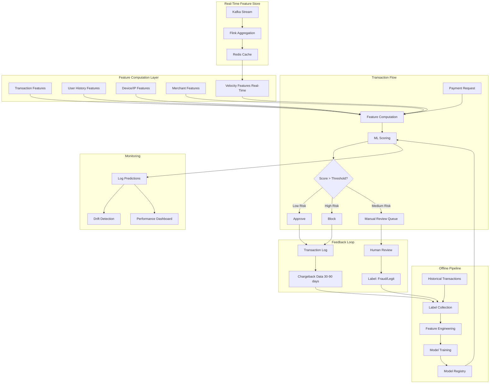

# Case Study 2: Real-Time Fraud Detection

> "Design a fraud detection system for a payments platform like Stripe."
> — Asked at: Stripe, Capital One, PayPal, Square, Amazon, Google

---

## Step 1: Problem Definition + Clarifying Questions

### What are we building?

A system that evaluates every payment transaction in real-time and decides whether it is fraudulent. The system must make a decision before the payment is authorized (within 100ms), blocking fraudulent transactions while minimizing false blocks on legitimate users.

### Clarifying questions to ask the interviewer

1. **Scale**: How many transactions per second? → Assume 10,000 TPS (transactions per second), 500M transactions/day
2. **Latency**: What is the maximum decision time? → Under 100ms (payment authorization flow)
3. **Fraud rate**: What percentage of transactions are fraudulent? → ~0.1% (severe class imbalance: 1 fraud per 1,000 legitimate)
4. **Cost asymmetry**: What is worse — blocking a legitimate user or missing fraud? → Missing fraud costs $200 average (chargeback + fees). Blocking a legitimate user costs ~$50 (customer friction + potential churn). But too many false blocks destroy trust.
5. **Fraud types**: What kinds of fraud? → Stolen credit cards, account takeover, synthetic identities, friendly fraud (cardholder disputes legitimate purchase)
6. **Feedback loop**: How do we learn about fraud? → Chargebacks arrive 30-90 days later; some fraud is flagged by manual review within 24 hours

### ML Problem Formulation

This is a **binary classification problem** with extreme class imbalance (~0.1% positive). The model predicts: "What is the probability this transaction is fraudulent?"

Key challenge: The decision must happen in real-time (<100ms), but the ground truth label (fraud/not fraud) arrives days or weeks later. This creates a delayed feedback problem.

---

## Step 2: Metrics

### Offline Metrics

| Metric | What It Measures | Target |
|--------|-----------------|--------|
| **Precision at fixed recall** | Of flagged transactions, how many are actually fraud? (at 90% recall) | > 0.05 (5%) |
| **Recall** | Of all fraud, how much do we catch? | > 0.90 (catch 90% of fraud) |
| **AUC-ROC** | Overall separation between fraud and legitimate | > 0.95 |
| **AUC-PR** | Precision-recall trade-off (more informative for imbalanced data) | > 0.40 |
| **False Positive Rate** | % of legitimate transactions incorrectly blocked | < 0.5% |

### Why Precision looks low (5%) and that is OK

If 0.1% of transactions are fraud, even a perfect model would have low precision when operating at high recall. At 90% recall on 500M transactions:
- True fraud: 500,000 → caught: 450,000
- Legitimate: 499,500,000 → false alarms at 0.5% FPR → 2,497,500

Precision = 450,000 / (450,000 + 2,497,500) = 15%. In practice, 5-15% precision at 90% recall is industry standard. The remaining flagged transactions go to manual review.

### Online Metrics

| Metric | What It Measures | Why It Matters |
|--------|-----------------|----------------|
| **Fraud loss rate** | $ lost to fraud / total $ processed | Primary business metric |
| **Block rate** | % of transactions blocked | Too high = customer friction |
| **Manual review rate** | % of transactions sent to human reviewers | Operational cost |
| **Customer complaint rate** | % of users reporting false blocks | Customer experience |
| **Chargeback rate** | % of transactions resulting in chargebacks | Regulatory requirement (<1%) |
| **Decision latency P99** | 99th percentile response time | Must stay under 100ms |

### Guardrail Metrics
- Customer churn rate (must not increase)
- Payment authorization rate (must not drop more than 0.3%)

---

## Step 3: High-Level Architecture

### Three-Tier Decision System

Not every transaction gets the same treatment:

1. **Auto-approve** (score < 0.1): ~95% of transactions. No friction for the user.
2. **Auto-block** (score > 0.9): ~0.5% of transactions. Obviously fraudulent patterns.
3. **Manual review** (0.1 < score < 0.9): ~4.5% of transactions. Sent to human analysts who see the transaction details, user history, and model explanation. This is where precision matters most — reviewers can only handle so many cases per hour.

---

## Step 4: Data Pipeline + Feature Engineering

### Data Sources

| Source | Data | Latency |
|--------|------|---------|
| Transaction payload | Amount, currency, merchant, card type, billing address | Real-time (in request) |
| User history | Past transactions, account age, verified status | Pre-computed (feature store) |
| Device fingerprint | Device ID, OS, browser, screen resolution | Real-time (in request) |
| IP/Geolocation | IP address, country, ISP, VPN detection | Real-time (enrichment API) |
| Velocity aggregates | Transactions in last 1min, 5min, 1hr, 24hr | Real-time (streaming) |

### Feature Engineering

#### Transaction Features (from the current request)
- **Amount risk score**: How unusual is this amount compared to the user's history? (z-score)
- **Merchant risk category**: MCC code mapped to historical fraud rate for that category
- **Currency mismatch**: Is the transaction currency different from the user's usual currency?
- **Time of day**: Normalized hour (fraud peaks at 2-5 AM local time)
- **Is round amount**: Fraudsters tend to test with round numbers ($100, $500)

#### User History Features (from feature store)
- **Account age**: Days since account creation (new accounts are higher risk)
- **Transaction count (30 days)**: Established users have more history
- **Average transaction amount**: Baseline for anomaly detection
- **Distinct merchants (30 days)**: Suddenly using many new merchants is suspicious
- **Failed transaction rate**: High failure rate suggests card testing
- **Shipping/billing address match rate**: Mismatches correlate with fraud

#### Velocity Features (computed in real-time via streaming)
- **Transaction count last 1 minute**: Card testing attacks do many small transactions rapidly
- **Transaction count last 1 hour**: Burst detection
- **Distinct merchants last 1 hour**: Rapid merchant hopping
- **Cumulative amount last 24 hours**: Spending spree detection
- **Failed attempts last 10 minutes**: Brute-force card validation

These are the most powerful features because they capture temporal patterns that static features miss. A single $50 transaction is normal. Five $50 transactions at five different merchants in 10 minutes is almost certainly fraud.

#### Device and Network Features
- **Is known device**: Has this device been used with this account before?
- **Device-account ratio**: How many accounts use this device? (>3 is suspicious)
- **IP-country vs billing-country match**: Transaction from Nigeria but billing address is Ohio
- **VPN/proxy detection**: Hiding true location
- **Browser fingerprint consistency**: Does the browser fingerprint match previous sessions?

#### Graph Features (advanced)
- **Account-device-IP graph**: Build a graph connecting accounts, devices, and IPs. Fraud rings share devices and IPs across multiple stolen accounts. Graph features like connected component size, degree centrality, and shared neighbors are extremely powerful.

### Feature Store Architecture

Fraud detection requires both batch and real-time features served together within 100ms. The feature store has two tiers:

- **Batch tier (updated daily)**: User history aggregates, account features, merchant risk scores. Computed in Spark, stored in a key-value store (DynamoDB or Redis).
- **Streaming tier (updated per-event)**: Velocity counts, running sums. Computed in Flink from a Kafka stream, stored in Redis with TTL-based expiry.

At inference time, the serving layer fetches from both tiers (parallel calls), combines them with transaction-level features from the request, and sends the full feature vector to the model. Total feature retrieval: ~15ms.

---

## Step 5: Model Selection + Training Strategy

### Model Architecture: Stacked Ensemble

Fraud detection uses an ensemble rather than a single model because different model types excel at different fraud patterns:

**Layer 1: Specialized Models**

| Model | What It Catches | Why |
|-------|----------------|-----|
| **XGBoost** | Known fraud patterns (velocity, amount anomalies) | Best at tabular features with feature interactions |
| **Neural Network (MLP)** | Complex non-linear patterns | Learns feature interactions the trees miss |
| **Isolation Forest** | Anomalous transactions (novel fraud types) | Unsupervised — detects patterns not in training data |

**Layer 2: Meta-Learner**
- Logistic Regression that takes the 3 model scores as input
- Learns the optimal weight for each model
- Also receives a few high-value raw features (transaction amount, account age)

### Why an ensemble?

- XGBoost is the strongest single model for tabular data but only catches fraud patterns present in training data
- Isolation Forest catches novel attack vectors (zero-day fraud) that supervised models miss because they were never labeled
- The meta-learner combines their strengths and is calibrated (its output probability is meaningful for threshold setting)

### Handling Extreme Class Imbalance (0.1% fraud)

| Technique | How It Works | Trade-off |
|-----------|-------------|-----------|
| **Class weights** | Weight fraud examples 1000x in loss function | Simple, no data manipulation |
| **SMOTE** | Generate synthetic fraud examples via interpolation | Can create unrealistic examples |
| **Undersampling** | Randomly drop legitimate examples to 10:1 ratio | Loses information |
| **Focal loss** | Down-weight easy negatives, focus on hard examples | Better gradient signal |
| **Our approach** | Class weights + focal loss | Best balance of simplicity and performance |

### Training Data and the Label Problem

The hardest part of fraud detection is getting labels:

- **Chargebacks**: Definitive fraud signal but arrives 30-90 days later
- **Manual review labels**: Available within 24 hours but only for the ~4.5% of transactions sent to review (selection bias)
- **Customer reports**: User reports unauthorized transaction (delayed, incomplete)

**Training strategy:**
1. Train on chargebacks (delayed but reliable labels)
2. Use manual review labels for fast model iteration (available next day)
3. Retrain weekly as new chargeback labels arrive
4. Use a time-based train/test split (train on month 1-2, test on month 3) to simulate real deployment

### Adversarial Considerations

Fraud is adversarial — fraudsters adapt to your model. When you block a pattern, they change tactics. This means:

- **Model staleness**: A model degrades faster than in non-adversarial settings. Weekly retraining is minimum.
- **Feature robustness**: Rely on features that are hard to manipulate (velocity patterns, graph features) over easy-to-fake features (billing address, email domain).
- **Concept drift**: Monitor the fraud pattern distribution over time. If new attack vectors emerge, the model may miss them until it is retrained with new labels.

---

## Step 6: Serving, Monitoring, and Trade-offs

### Serving Architecture

| Component | Technology | Latency Budget |
|-----------|-----------|---------------|
| Feature retrieval (batch) | Redis / DynamoDB | 10ms |
| Feature retrieval (streaming) | Redis | 5ms |
| Transaction feature extraction | Application logic | 5ms |
| Model inference (ensemble) | ONNX Runtime | 20ms |
| Decision logic + rules engine | Application logic | 5ms |
| Network + serialization | gRPC | 10ms |
| **Total** | | **~55ms** (within 100ms budget) |

### Rules Engine (Post-Model)

The ML model is not the only decision maker. A rules engine applies hard constraints:

- Block all transactions > $10,000 from accounts < 7 days old (regardless of model score)
- Block all transactions from sanctioned countries (OFAC compliance)
- Block if 3+ failed transactions in last 5 minutes from same card
- Allow all transactions from whitelisted enterprise accounts

Rules exist for regulatory compliance and for catching obvious fraud that does not need ML. The model handles the nuanced cases.

### Monitoring

| What to Monitor | How to Detect Problems | Action |
|----------------|----------------------|--------|
| Fraud loss rate trending up | Daily comparison vs 30-day baseline | Investigate missed fraud patterns, retrain |
| Block rate trending up | Hourly monitoring | Check for model miscalibration or data pipeline issues |
| Latency P99 > 100ms | Prometheus histogram | Scale serving infrastructure or optimize model |
| Feature freshness lag | Monitor streaming pipeline lag | Fix Kafka/Flink pipeline if lag > 1 minute |
| Label distribution shift | Compare fraud rate in recent data vs training data | May need to adjust class weights |
| New fraud patterns | Cluster blocked transactions; look for novel clusters | Add new features, retrain |

### Trade-offs Discussed

| Decision | Option A | Option B | Our Choice | Why |
|----------|----------|----------|------------|-----|
| Model type | Single XGBoost | Stacked ensemble | Ensemble | Novel fraud detection via Isolation Forest |
| Serving format | Full model | ONNX optimized | ONNX | 3-5x faster inference |
| Decision tiers | Binary (approve/block) | Three-tier (approve/review/block) | Three-tier | Reduces false blocks; humans handle uncertainty |
| Feature computation | All batch | Batch + streaming | Batch + streaming | Velocity features are critical and need real-time |
| Retraining | Monthly | Weekly | Weekly | Adversarial environment demands fresh models |
| Threshold tuning | Maximize F1 | Minimize business cost | Business cost | FN costs 4x more than FP |

### What would you do differently at larger scale?

- **Graph neural networks**: Build a transaction graph connecting users, merchants, devices, and IPs. GNNs can detect fraud rings (groups of accounts coordinating) that individual transaction models miss.
- **Online learning**: Instead of weekly retraining, update the model incrementally with each new labeled transaction. This reduces the window where new fraud patterns go undetected.
- **Federated detection**: Share fraud signals across payment processors (without sharing raw data) to catch fraudsters who operate across platforms.
- **Explainability**: Add SHAP or LIME explanations for every blocked transaction. Analysts reviewing blocked transactions need to understand why the model flagged them.

---

## Key Interview Talking Points

1. **Lead with the latency constraint** (100ms). This shapes every architectural decision.
2. **Emphasize velocity features**. These are the highest-value features in fraud detection and show you understand temporal patterns.
3. **Discuss the label delay problem**. Chargebacks take 30-90 days. This is a unique challenge that distinguishes fraud from most ML problems.
4. **Mention the adversarial nature**. Fraud is not static — fraudsters adapt. This justifies frequent retraining and robust features.
5. **Quantify the cost asymmetry**. Show you can translate business costs into threshold decisions.
6. **Bring up the rules engine**. Production fraud systems are not pure ML — they combine models with hard rules for compliance and edge cases.
