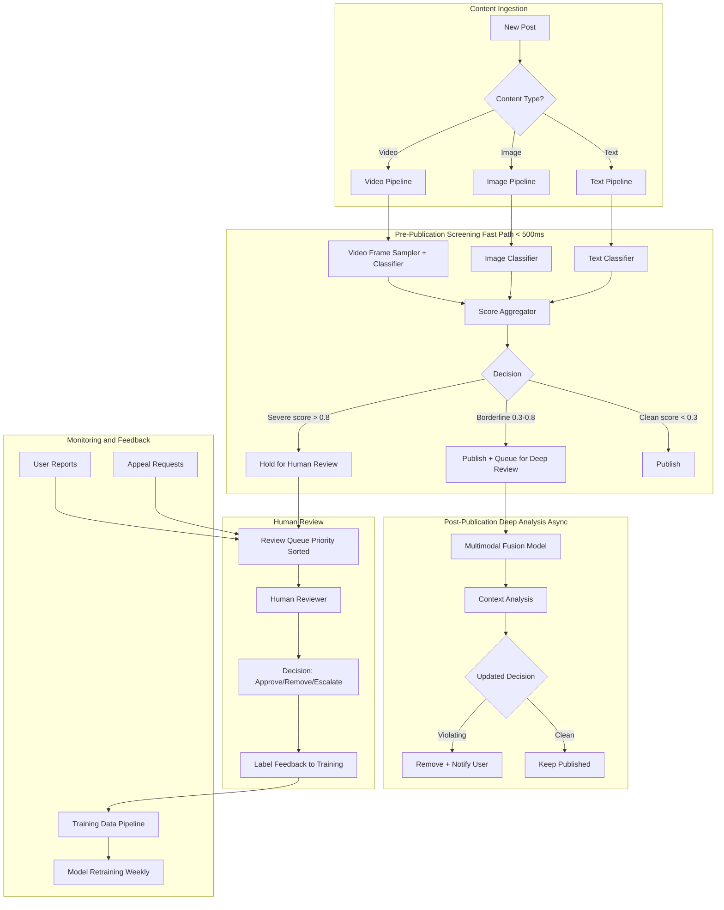

# Case Study 3: Content Moderation System

> "Design an automated content moderation system for a social media platform."
> — Asked at: Meta, TikTok, YouTube, Twitter/X, Pinterest, LinkedIn

---

## Step 1: Problem Definition + Clarifying Questions

### What are we building?

A system that automatically detects and actions harmful content posted on a social media platform. This includes text posts, images, videos, and comments. Harmful content categories include hate speech, violence, nudity, spam, misinformation, harassment, and self-harm.

### Clarifying questions to ask the interviewer

1. **Scale**: How much content per day? → Assume 500M posts/day (text, image, video mix)
2. **Content types**: Text only or multimodal? → Multimodal: text + images + videos + comments
3. **Latency**: Must moderation happen before content is shown, or can it be post-publication? → Hybrid: fast pre-screening before publish, deeper analysis after
4. **Categories**: How many violation types? → 8-10 categories (hate speech, violence, nudity, spam, etc.)
5. **Actions**: What happens to flagged content? → Remove, reduce distribution, add warning label, send to human review
6. **Error tolerance**: Is it worse to miss harmful content or to remove legitimate content? → Both are bad. Missing harmful content causes user harm and regulatory risk. Over-removal causes censorship complaints and user churn. Balance is critical.
7. **Appeals**: Can users appeal moderation decisions? → Yes, and appeal outcomes feed back into model training

### ML Problem Formulation

This is a **multi-label classification problem**. Each piece of content can violate zero, one, or multiple policies simultaneously (e.g., an image can be both violent AND hateful). For each violation category, the model predicts: "What is the probability this content violates policy X?"

Additional complexity: This is a **multimodal problem**. A meme might have an innocent image and innocent text, but the combination is hateful. The system must understand content across modalities.

---

## Step 2: Metrics

### Offline Metrics

| Metric | What It Measures | Target |
|--------|-----------------|--------|
| **Precision per category** | Of content flagged for category X, how much actually violates? | > 0.85 for auto-removal |
| **Recall per category** | Of all violating content for category X, how much do we catch? | > 0.90 for severe violations (CSAM, terrorism) |
| **F1 per category** | Harmonic mean of precision and recall | > 0.80 |
| **AUC-ROC per category** | Overall ranking quality per violation type | > 0.95 |
| **Multi-label accuracy** | Exact match of all labels predicted correctly | > 0.75 |
| **False positive rate** | % of clean content incorrectly flagged | < 1% |

### Online Metrics

| Metric | What It Measures | Why It Matters |
|--------|-----------------|----------------|
| **Proactive detection rate** | % of violating content caught before user reports | Shows system catches problems early |
| **Prevalence** | % of content views that are violating content | Primary safety metric (must trend down) |
| **User report rate** | Reports per 1M content views | High rate = model is missing things |
| **Appeal overturn rate** | % of moderation decisions reversed on appeal | High rate = model is too aggressive |
| **Reviewer agreement rate** | How often human reviewers agree with model decisions | Model calibration signal |
| **Time to action** | Median time from post to moderation decision | Speed of content removal |

### Guardrail Metrics
- User engagement (must not drop due to over-removal)
- Creator posting volume (must not drop — creators leaving = content supply problem)
- Content diversity (ensure moderation does not disproportionately impact specific communities)

---

## Step 3: High-Level Architecture

### Why two-pass architecture?

A single pass cannot balance speed and accuracy:

1. **Fast path (pre-publication, <500ms)**: Uses lightweight per-modality classifiers. Optimized for recall on severe violations (terrorism, CSAM). Allows most content through quickly. Catches the obvious violations.

2. **Deep path (post-publication, async)**: Uses expensive multimodal models that understand text + image together. Runs within minutes of publication. Catches nuanced violations like coded hate speech, memes with layered meaning, and context-dependent harassment.

This architecture ensures users see their content published quickly (good UX) while still catching harmful content before significant distribution.

---

## Step 4: Data Pipeline + Feature Engineering

### Data Sources

| Source | Data | Volume |
|--------|------|--------|
| Post content | Text, images, videos, audio tracks | 500M posts/day |
| User metadata | Account age, follower count, past violations, trust score | Pre-computed |
| Engagement signals | Shares, comments, reports, reaction distribution | Real-time stream |
| Human review labels | Reviewer decisions + violation categories | ~5M labels/day |
| Appeal outcomes | Overturned vs upheld decisions | ~100K/day |
| Policy definitions | Violation category rules (updated by policy team) | Updated periodically |

### Feature Engineering

#### Text Features
- **Transformer embeddings**: BERT or RoBERTa embeddings of the post text (768-dim)
- **Toxicity signals**: Scores from a pre-trained toxicity classifier (Perspective API style)
- **Named entity detection**: Identifies references to specific groups, individuals, events
- **Language detection**: Moderation models may perform differently across languages
- **Keyword signals**: Presence of known slurs, coded language, dog whistles (maintained vocabulary list)
- **Semantic similarity to known violations**: Cosine similarity to embeddings of previously-removed content

#### Image Features
- **CNN embeddings**: ResNet-50 or EfficientNet embeddings of the image (2048-dim)
- **NSFW classifier score**: Pre-trained nudity/explicit content detector
- **Violence detector score**: Blood, weapons, graphic content detection
- **OCR text extraction**: Text embedded in images (memes, screenshots) → fed into text classifier
- **Object detection**: People, weapons, flags, symbols detected via YOLO or similar
- **Perceptual hash (pHash)**: Fingerprint for matching against known violating images database

#### Video Features
- **Keyframe sampling**: Extract 1 frame per second → run image classifier on each
- **Audio transcription**: Speech-to-text → feed transcript into text classifier
- **Audio classification**: Detect gunshots, screaming, hate speech in audio track
- **Temporal aggregation**: Max/mean of per-frame scores across the video

#### Context Features
- **User trust score**: Historical violation rate, account age, verification status. A user with 5 past violations posting borderline content should be treated differently than a 10-year verified account.
- **Virality velocity**: Content spreading rapidly gets higher priority for review (more potential harm)
- **Comment toxicity**: If a post's comments are highly toxic, the post itself may be problematic even if it appears clean in isolation
- **Community context**: Same content may be acceptable in a medical education group but violating in a general audience context

#### Multimodal Fusion Features
- **Text-image alignment score**: Does the text match the image semantically? Misalignment can indicate sarcasm or coded messaging.
- **CLIP embedding**: Joint text-image embedding that captures cross-modal meaning (critical for meme understanding)
- **Contradiction detection**: Text says "just a joke" but image shows graphic violence → higher risk score

---

## Step 5: Model Selection + Training Strategy

### Fast Path Models (Per-Modality, <500ms)

| Model | Input | Architecture | Why |
|-------|-------|-------------|-----|
| Text classifier | Post text | DistilBERT fine-tuned | 3x faster than BERT, 97% accuracy |
| Image classifier | Post image | EfficientNet-B3 fine-tuned | Good accuracy/speed tradeoff |
| Video classifier | Sampled frames | EfficientNet per frame + temporal aggregation | Cannot process full video in 500ms |

Each model outputs per-category probabilities for all violation types. The score aggregator combines them:
final_score[category] = max(text_score[category], image_score[category], video_score[category])

Using max instead of average ensures that if ANY modality detects a violation, the content is flagged. This maximizes recall.

### Deep Path Model (Multimodal, Async)

**Architecture: Multimodal Transformer**

- **Text encoder**: BERT → 768-dim text embedding
- **Image encoder**: ViT (Vision Transformer) → 768-dim image embedding
- **Fusion layer**: Cross-attention between text and image embeddings. This is where the model learns that "nice people" (text) + swastika image = hate speech, even though neither modality is harmful alone.
- **Classification heads**: One output head per violation category (multi-label sigmoid outputs)
- **Pre-training**: Initialize with CLIP weights (already trained on text-image alignment)

### Training Strategy

**Training data composition:**
- Human reviewer decisions: Primary source (5M labels/day)
- Appeal outcomes: High-value corrections (when a reviewer was wrong)
- Synthetic augmentation: Paraphrase violating text to capture linguistic variation
- Hard negative mining: Clean content that the model incorrectly flags → add to training set

**Addressing training challenges:**

| Challenge | Solution |
|-----------|----------|
| Class imbalance (most content is clean) | Category-specific sampling: train with 50/50 ratio per category |
| Annotator disagreement | Multi-reviewer consensus (3 reviewers per item, majority vote) |
| Evolving policies | Retrain weekly with updated policy labels |
| Cultural context | Region-specific models or region features in a global model |
| Adversarial evasion | Augmentation with character substitution (h@te, vi0lence), Unicode tricks, leetspeak |
| New violation types | Zero-shot classification using policy descriptions as prompts |

**Active learning pipeline:**
Not all content needs human review equally. Prioritize:
1. Content near the decision boundary (score 0.4-0.6) — most informative for training
2. Content from under-represented categories or languages
3. Content where model disagrees with user reports

---

## Step 6: Serving, Monitoring, and Trade-offs

### Serving Architecture

| Component | Latency (Fast Path) | Latency (Deep Path) |
|-----------|-------------------|-------------------|
| Content download + preprocessing | 50ms | 200ms |
| Text model inference | 30ms | 100ms |
| Image model inference | 80ms | 300ms |
| Multimodal fusion | N/A | 200ms |
| Score aggregation + decision | 10ms | 50ms |
| **Total** | **~170ms** | **~850ms** |

Fast path runs synchronously before publish. Deep path runs asynchronously after publish.

### Hash-Based Detection (Instant, No ML)

Before any ML model runs, check the content against known violation databases:

- **PhotoDNA / pHash matching**: Fingerprint the image and compare against a database of known CSAM and terrorist content. Match = instant removal. Industry-shared databases (NCMEC, GIFCT) contain millions of known violating images.
- **Text hash matching**: Exact or near-exact match of previously removed text content.

This catches re-uploads of known violating content in <10ms with zero false positives.

### Monitoring

| What to Monitor | How | Alert |
|----------------|-----|-------|
| Prevalence per category | Daily trend of violating content as % of all views | Spike > 2x baseline |
| Appeal overturn rate | Weekly trend per category | > 10% overturn rate |
| Model latency P99 | Prometheus | Fast path > 500ms |
| False positive rate per demographic | Fairness audit monthly | Disproportionate impact on any group |
| New attack patterns | Cluster flagged-but-overturned content | Novel evasion techniques |
| Reviewer queue depth | Real-time queue length | > 24hr backlog |

### Fairness Considerations

Content moderation has significant fairness risks:

- **Dialect bias**: Models trained on standard English may flag African American Vernacular English (AAVE) as toxic at higher rates
- **Cultural context**: Content acceptable in one culture may be flagged as violating in another
- **Reclaimed language**: Marginalized communities may use slurs in non-hateful, reclaimed ways

**Mitigations:**
- Slice evaluation metrics by demographic group, language, and region
- Include diverse annotators from different cultural backgrounds
- Maintain a "reclaimed language" context model that considers the author's identity and community
- Regular fairness audits with external researchers

### Trade-offs Discussed

| Decision | Option A | Option B | Our Choice | Why |
|----------|----------|----------|------------|-----|
| Timing | Pre-publication only | Pre + post-publication | Pre + post | Speed + accuracy balance |
| Modality fusion | Late fusion (separate scores combined) | Early fusion (joint model) | Both | Fast path uses late; deep path uses early |
| Review queue priority | FIFO | Risk-score sorted | Risk-score | Highest-harm content reviewed first |
| Model per language | One multilingual model | Separate per-language models | Multilingual + high-resource per-language | Best accuracy for major languages, coverage for all |
| Auto-removal threshold | Conservative (high threshold) | Aggressive (low threshold) | Category-dependent | Auto-remove CSAM/terrorism; human review for borderline hate speech |
| Retraining | Monthly | Weekly | Weekly | Policies evolve, new evasion techniques emerge weekly |

### What would you do differently at larger scale?

- **LLM-based moderation**: Use large language models (GPT-4 class) as a secondary reviewer for borderline cases. The LLM can understand nuance, sarcasm, and context better than classification models. Trade-off: 10-100x more expensive per inference.
- **User-level risk scoring**: Instead of evaluating each post independently, maintain a user-level trust score that influences moderation thresholds. Trusted users get more latitude; repeat violators get stricter screening.
- **Proactive detection**: Instead of waiting for content to be posted, monitor for coordinated campaigns (brigading, coordinated harassment) using graph analysis of user interaction patterns.
- **Federated hash sharing**: Share content hashes (not content itself) with other platforms via industry coalitions to catch cross-platform abuse campaigns.

---

## Key Interview Talking Points

1. **Start with the two-pass architecture**. Pre-publication (fast, high recall) + post-publication (deep, high precision). This is the expected structure.
2. **Emphasize multimodal understanding**. A meme with innocent text and innocent image but hateful meaning together. Mention CLIP for cross-modal embeddings.
3. **Discuss the hash matching layer**. This is the cheapest and most reliable first line of defense. Shows you understand production systems are not pure ML.
4. **Bring up fairness proactively**. Dialect bias, cultural context, and reclaimed language. This shows maturity and awareness of real-world impact.
5. **Mention the human-in-the-loop design**. ML does not make the final call on borderline cases. Human reviewers + appeals process + feedback loop to training.
6. **Discuss adversarial evasion**. Users intentionally modify content to evade detection (character substitution, Unicode tricks, image perturbation). Show you understand this is an arms race.
