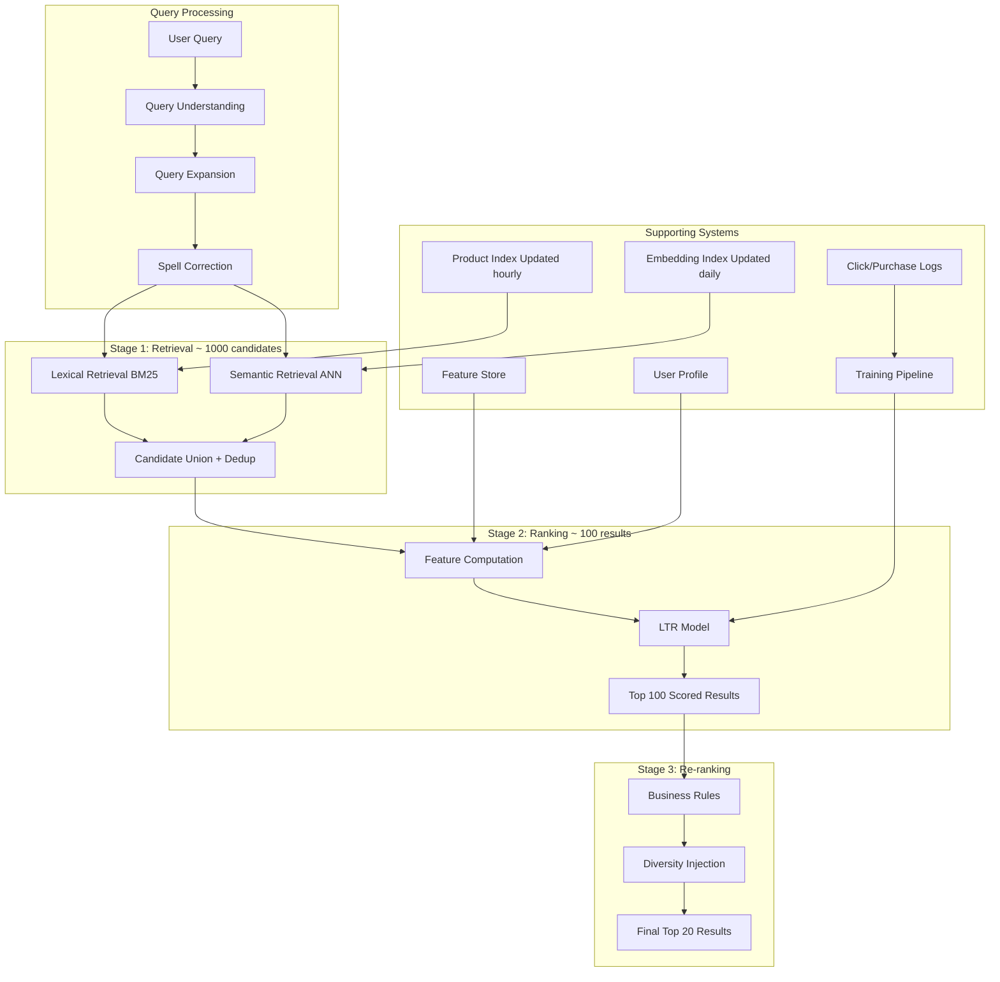

# Case Study 4: Search Ranking System

> "Design a search ranking system for an e-commerce platform like Amazon."
> — Asked at: Google, Amazon, YouTube, Spotify, Airbnb, LinkedIn

---

## Step 1: Problem Definition + Clarifying Questions

### What are we building?

A system that takes a user's search query and returns a ranked list of products ordered by relevance and purchase intent. When a user searches "wireless earbuds under $50", the system must retrieve relevant products from a catalog of millions and rank them so the most useful results appear first.

### Clarifying questions to ask the interviewer

1. **Scale**: How large is the catalog? → Assume 50M products, 100M queries/day
2. **Latency**: What is the acceptable response time? → Under 300ms (page load)
3. **Query types**: What kinds of queries? → Keyword ("blue running shoes"), navigational ("Apple AirPods"), broad ("gifts for mom"), long-tail ("waterproof Bluetooth speaker for shower")
4. **Personalization**: Should results be personalized per user? → Yes, same query should return different results for different users based on their history
5. **Ranking signals**: What defines a "good" result? → Primary: purchase after search. Secondary: click, add-to-cart. Also consider: relevance to query, product quality, freshness
6. **Ads**: Are there sponsored results mixed in? → Out of scope for this design, but note the interaction

### ML Problem Formulation

This is a **learning-to-rank (LTR) problem**. Given a query and a set of candidate products, predict a relevance score for each product and sort by that score. The model predicts: "Given this query and this product, what is the probability the user will purchase?"

Key distinction from recommendation systems: search has **explicit user intent** (the query). Recommendations infer intent from behavior. This changes the feature engineering and model design significantly.

---

## Step 2: Metrics

### Offline Metrics

| Metric | What It Measures | Target |
|--------|-----------------|--------|
| **NDCG@10** | Are the most relevant results ranked highest in the top 10? | > 0.55 |
| **MRR (Mean Reciprocal Rank)** | How high is the first relevant result on average? | > 0.65 |
| **Precision@5** | What fraction of the top 5 results are relevant? | > 0.70 |
| **Recall@50** | Of all relevant products, how many are in the top 50? | > 0.80 |
| **AUC-ROC** | Pairwise ranking quality (can the model distinguish better from worse results?) | > 0.85 |

### NDCG Explained

NDCG (Normalized Discounted Cumulative Gain) is the standard ranking metric. It works as follows:

- Each result has a relevance grade (e.g., 0=irrelevant, 1=clicked, 2=added to cart, 3=purchased)
- Higher grades at higher positions contribute more to the score
- The "discounted" part penalizes relevant results that appear lower (position 10 contributes less than position 1)
- "Normalized" means we divide by the ideal ranking's score, giving a value between 0 and 1

NDCG is preferred over precision/recall because it is position-aware and handles graded relevance (not just binary relevant/irrelevant).

### Online Metrics

| Metric | What It Measures | Why It Matters |
|--------|-----------------|----------------|
| **Search conversion rate** | % of searches that lead to a purchase | Primary business metric |
| **Click-through rate** | % of impressions clicked in search results | Engagement signal |
| **Zero-result rate** | % of queries returning no results | Coverage problem |
| **Reformulation rate** | % of queries followed by another search | High rate = first results were bad |
| **Revenue per search** | Average revenue generated per search | Business value |
| **Time to first click** | How quickly users click a result | Confidence in ranking quality |

### Guardrail Metrics
- Overall revenue (must not decrease)
- Return rate (must not increase — bad results lead to wrong purchases)
- New product discovery rate (must not decrease — avoid always showing popular items)

---

## Step 3: High-Level Architecture

### Three-stage funnel

1. **Retrieval (50M → ~1,000)**: Fast, approximate matching. Uses both lexical (BM25) and semantic (embedding) retrieval in parallel. Speed > precision.

2. **Ranking (1,000 → ~100)**: Apply a complex ML model with rich features to score every candidate. Precision > speed.

3. **Re-ranking (100 → 20)**: Apply business rules (boost new products, ensure category diversity, remove out-of-stock). Not ML — rule-based.

---

## Step 4: Data Pipeline + Feature Engineering

### Query Understanding

Before retrieval, the query goes through a processing pipeline:

| Step | Input → Output | Example |
|------|---------------|---------|
| **Tokenization** | Raw query → tokens | "running shoes men's" → ["running", "shoes", "men's"] |
| **Spell correction** | Misspelled → corrected | "wireles earbuds" → "wireless earbuds" |
| **Query expansion** | Query → expanded query | "laptop" → "laptop notebook computer" (synonyms) |
| **Intent classification** | Query → intent type | "AirPods Pro" → navigational; "gifts for mom" → broad |
| **Category prediction** | Query → product category | "yoga mat" → Sports > Fitness > Yoga |
| **Entity extraction** | Query → structured attributes | "red Nike shoes size 10" → {color: red, brand: Nike, size: 10} |

Query understanding is often a separate ML model (BERT-based classifier) that enriches the raw query with structured signals. These signals improve both retrieval and ranking.

### Retrieval: Lexical + Semantic (Hybrid Search)

#### Lexical Retrieval (BM25)

BM25 is a term-frequency based algorithm. It scores documents by how many query terms appear in the document, with diminishing returns for repeated terms and normalization for document length.

**Strengths**: Exact keyword matching. If user searches "iPhone 15 Pro Max", BM25 finds products with exactly those terms.

**Weakness**: Vocabulary mismatch. If the user searches "earphones" but the product says "earbuds", BM25 misses it.

#### Semantic Retrieval (ANN)

Encode both the query and product titles into embeddings (using a fine-tuned sentence transformer). Find the nearest product embeddings to the query embedding using Approximate Nearest Neighbor search (FAISS or ScaNN).

**Strengths**: Understands meaning. "Earphones" and "earbuds" have similar embeddings. "Gift for a 5 year old girl" retrieves toys even though the word "toy" is not in the query.

**Weakness**: Can retrieve semantically similar but irrelevant products. "Apple laptop" might retrieve "apple fruit" if embeddings are not domain-tuned.

#### Why both?

Neither lexical nor semantic retrieval alone is sufficient. The union of both candidate sets captures more relevant products than either alone. Research consistently shows hybrid retrieval outperforms either method by 10-20% on recall@100.

### Feature Engineering for Ranking

#### Query-Product Relevance Features
- **BM25 score**: Lexical relevance between query and product title/description
- **Semantic similarity**: Cosine similarity between query embedding and product embedding
- **Query-title term overlap**: % of query terms that appear in the product title
- **Category match**: Does the product category match the predicted query category?
- **Attribute match**: For structured queries ("red Nike shoes size 10"), do extracted attributes match product attributes?

#### Product Quality Features
- **Historical CTR**: Click-through rate of this product across all queries (position-debiased)
- **Conversion rate**: Purchase rate when this product is shown in search results
- **Average rating**: Customer review rating (1-5 stars)
- **Review count**: Number of reviews (proxy for popularity and trust)
- **Return rate**: Products with high return rates are lower quality
- **Price competitiveness**: Product price vs average price in its category
- **Freshness**: Days since product was listed (newer products may need a boost)

#### User-Product Personalization Features
- **User category affinity**: Does the user frequently browse/buy from this product's category?
- **User brand affinity**: Has the user purchased from this brand before?
- **User price range**: Is this product in the user's typical price range?
- **Past interaction**: Has the user viewed, clicked, or purchased this specific product before?
- **Collaborative signal**: Users with similar purchase history bought this product

#### Context Features
- **Device type**: Mobile vs desktop (different screen sizes affect ranking)
- **Time of day**: Morning searches may have different intent than evening
- **Season**: Holiday season, back-to-school, etc.
- **Location**: Regional product availability and preferences

### Position Bias and Debiasing

A critical problem in search ranking: users click higher-ranked results more often regardless of relevance (position bias). A product at position 1 gets 10x more clicks than the same product at position 10.

If you train on raw click data, the model learns "top-ranked products are relevant" which is circular. Solutions:

- **Inverse propensity weighting (IPW)**: Weight each training example by 1/P(click | position). Items at position 1 are down-weighted because they would get clicks regardless of relevance.
- **Position as a feature**: Include position as a model feature during training, then set it to a constant (e.g., position=1) at inference time. The model learns to factor out position effects.
- **Randomization experiments**: Occasionally shuffle results randomly for a small percentage of traffic. These unbiased clicks become high-quality training data.

---

## Step 5: Model Selection + Training Strategy

### Learning-to-Rank Approaches

There are three families of LTR models:

| Approach | What It Optimizes | Example |
|----------|------------------|---------|
| **Pointwise** | Predict absolute relevance of each item independently | Logistic regression predicting P(click) |
| **Pairwise** | Predict which of two items is more relevant | LambdaMART: for each pair (A,B), predict "is A more relevant than B?" |
| **Listwise** | Optimize the ranking of the entire list directly | ListNet, LambdaRank: directly optimize NDCG |

### Our Choice: LambdaMART (Gradient Boosted Trees)

LambdaMART is the industry standard for search ranking. It is a pairwise LTR approach built on gradient boosted trees.

**Why LambdaMART?**
- Directly optimizes NDCG (through lambda gradients)
- Handles heterogeneous features naturally (no normalization needed)
- Interpretable feature importance
- Fast inference (tree traversal is O(depth), not O(features) like neural networks)
- Battle-tested at scale (used at Microsoft Bing, Yahoo, and many others)

**Architecture details:**
- 500 trees, max depth 8, learning rate 0.05
- Pairwise training: for each query, create pairs of (relevant product, irrelevant product) and train the model to rank the relevant one higher
- Lambda gradient: weight each pair by how much swapping them would change NDCG (swapping positions 1 and 2 matters more than swapping 99 and 100)

### Alternative: Neural Ranking Model

For teams with more compute budget, a transformer-based cross-encoder can improve ranking quality:

- **Input**: Concatenate [query, product title, product attributes] as a single text sequence
- **Model**: Fine-tuned BERT that outputs a relevance score
- **Advantage**: Understands deep semantic interactions between query and product
- **Disadvantage**: 100x slower than LambdaMART (one BERT forward pass per candidate)

In practice, use LambdaMART for the main ranking (1,000 candidates) and a neural model for re-ranking the top 50 if latency allows.

### Training Data

| Signal | Relevance Label | Weight |
|--------|----------------|--------|
| Purchase after search | 3 (highly relevant) | Highest — strongest intent signal |
| Add to cart after search | 2 (relevant) | High |
| Click after search | 1 (somewhat relevant) | Medium — but must debias for position |
| Impression but no click | 0 (irrelevant) | Low — but must account for position bias |

**Training pipeline:**
1. Collect search logs: (query, user, product, position, action)
2. Apply position debiasing (IPW or position-as-feature)
3. Create pairwise training data: for each query, pair every purchased product with 20 random non-clicked products
4. Train LambdaMART with NDCG as the optimization target
5. Validate on time-based split (train on week 1-3, validate on week 4)
6. Retrain daily to capture trending products and query pattern shifts

---

## Step 6: Serving, Monitoring, and Trade-offs

### Serving Architecture

| Component | Technology | Latency Budget |
|-----------|-----------|---------------|
| Query understanding | BERT-based classifier | 30ms |
| Lexical retrieval (BM25) | Elasticsearch / Lucene | 30ms |
| Semantic retrieval (ANN) | FAISS / ScaNN | 20ms |
| Candidate merge + dedup | Application logic | 10ms |
| Feature computation | Feature Store (Redis) | 20ms |
| LTR model scoring | LightGBM / XGBoost | 15ms |
| Re-ranking + business rules | Application logic | 10ms |
| Network + serialization | | 15ms |
| **Total** | | **~150ms** (within 300ms budget) |

BM25 and ANN retrieval run in parallel, saving ~30ms.

### Index Architecture

The product index must be searchable by both keywords and embeddings:

- **Inverted index (for BM25)**: Maps terms to product IDs. Updated hourly as products are added/removed. Technology: Elasticsearch.
- **Vector index (for ANN)**: Maps product IDs to embeddings. Updated daily (embedding recomputation). Technology: FAISS with IVF-PQ (Inverted File with Product Quantization) for memory efficiency at 50M scale.

### Monitoring

| What to Monitor | How | Alert |
|----------------|-----|-------|
| NDCG@10 (offline, weekly) | Evaluate on held-out test set | Drop > 5% from baseline |
| Search conversion rate | Daily A/B test dashboard | Drop > 3% |
| Zero-result rate | Per-query tracking | Spike > 5% |
| Query latency P99 | Prometheus | > 300ms |
| Reformulation rate | Session analysis | Increase > 10% |
| Index freshness | Time since last index update | > 2 hours |
| Feature drift | Distribution comparison of key features | Significant KS-test shift |

### Trade-offs Discussed

| Decision | Option A | Option B | Our Choice | Why |
|----------|----------|----------|------------|-----|
| Retrieval | BM25 only | BM25 + semantic (hybrid) | Hybrid | 15-20% recall improvement |
| Ranking model | Neural (BERT) | LambdaMART (trees) | LambdaMART | 10x faster inference, comparable quality |
| Personalization | None (same results for all) | Per-user features | Per-user | 8-12% conversion lift |
| Position debiasing | None | IPW | IPW | Without it, model reinforces existing ranking |
| Index update | Real-time | Hourly | Hourly | Acceptable freshness with manageable infrastructure |
| Query expansion | None | Synonym expansion | Expansion | Reduces zero-result rate by 30% |

### What would you do differently at larger scale?

- **Multi-stage neural ranking**: Add a lightweight neural re-ranker (distilled BERT, 6 layers) between LambdaMART and final results. It re-scores the top 50 results with deeper semantic understanding. Adds ~40ms latency but improves NDCG by 3-5%.
- **Learned dense retrieval**: Replace the separate BM25 + ANN retrieval with a single learned dense retrieval model (ColBERT or SPLADE) that combines lexical and semantic matching in one pass.
- **Query-specific ranking models**: Train separate ranking models for different query intents (navigational, product-type, broad). A navigational query like "AirPods Pro" needs different ranking logic than "gifts for mom".
- **Counterfactual evaluation**: Use off-policy evaluation methods to estimate the impact of ranking changes without running live A/B tests. This enables faster iteration.

---

## Key Interview Talking Points

1. **Start with the three-stage funnel** (retrieval → ranking → re-ranking). This is the universal search architecture.
2. **Explain hybrid retrieval** (BM25 + semantic). Mention specific weaknesses of each and why the combination works.
3. **Name LambdaMART** as the ranking model. It is the industry standard for a reason, and saying it signals expertise.
4. **Discuss position bias explicitly**. This is the single biggest pitfall in training search ranking models. Interviewers specifically test for this.
5. **Break down the latency budget**. Showing how 300ms is allocated across components demonstrates system-level thinking.
6. **Mention NDCG by name** and explain why it is preferred over precision/recall for ranking (position-aware, graded relevance).
