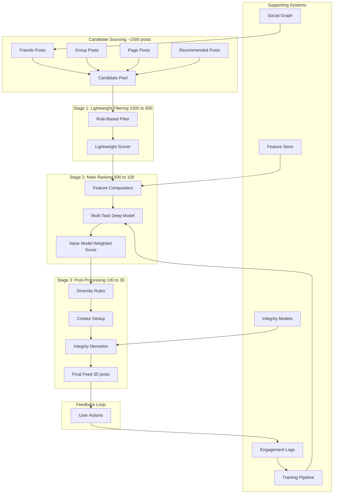

# Case Study 5: News Feed Ranking

> "Design the ranking system for a social media news feed like Facebook or LinkedIn."
> — Asked at: Meta, Twitter/X, LinkedIn, TikTok, Pinterest, Snapchat

---

## Step 1: Problem Definition + Clarifying Questions

### What are we building?

A system that ranks content in a user's feed. When a user opens the app, they have potentially thousands of new posts from friends, pages, and groups. The ranking system selects and orders the most relevant content so the user sees the best posts first.

### Clarifying questions to ask the interviewer

1. **Scale**: How many users and posts? → Assume 2B daily active users, each with ~1,500 candidate posts at any feed load
2. **Latency**: What is the response time budget? → Under 500ms for the initial feed load
3. **Content types**: What content appears in the feed? → Text posts, images, videos, links, stories, ads, group posts, page posts, reshares
4. **Ranking objective**: What does "best" mean? → Maximize long-term user engagement (not just clicks). User should find the feed valuable and come back.
5. **Chronological option**: Do users have a chronological feed option? → Yes, but ranked feed is the default because it performs significantly better on engagement metrics
6. **Creator balance**: Do we need to ensure diverse creators in the feed? → Yes, avoid showing 10 posts from the same person consecutively

### ML Problem Formulation

This is a **multi-objective ranking problem**. For each candidate post, predict the probability of multiple engagement actions:
- P(click), P(like), P(comment), P(share), P(spend >30s viewing), P(hide), P(report)

The final ranking score is a weighted combination of these predictions, where positive actions have positive weights and negative actions (hide, report) have negative weights. The weights encode the platform's values about what kind of engagement matters.

### Why not just optimize for clicks?

Optimizing purely for clicks leads to clickbait, sensationalism, and rage-bait (content that provokes anger gets more engagement). This degrades the platform over time as users feel manipulated. The multi-objective approach lets the platform value meaningful engagement (comments, shares, long viewing time) over shallow engagement (clicks, rage reactions).

---

## Step 2: Metrics

### Offline Metrics

| Metric | What It Measures | Target |
|--------|-----------------|--------|
| **Normalized Entropy (NE)** | How well-calibrated are predicted probabilities? (lower is better) | < 0.95 relative to baseline |
| **AUC-ROC per action** | Ranking quality for each engagement type | > 0.80 per action |
| **Log-loss per action** | Prediction accuracy for each engagement probability | < baseline model |
| **NDCG@20** | Are the best posts ranked highest? | > 0.50 |

### Normalized Entropy (NE) Explained

NE is the standard metric at Meta for feed ranking models. It is the log-loss of the model divided by the log-loss of a baseline that always predicts the average engagement rate. NE < 1.0 means the model is better than always predicting the average. Lower is better. A 1% improvement in NE is considered significant at scale.

### Online Metrics

| Metric | What It Measures | Why It Matters |
|--------|-----------------|----------------|
| **Daily Active Users (DAU)** | How many users return each day | Long-term platform health |
| **Session duration** | Time spent per session | Engagement depth |
| **Sessions per day** | How many times users open the app | Retention signal |
| **Meaningful Social Interactions (MSI)** | Comments, shares, and reactions between connected users | Meta's stated optimization target |
| **Content production** | New posts created per day | Creator health — if creators leave, content supply drops |
| **Negative feedback rate** | Hides, unfollows, reports per 1,000 impressions | User dissatisfaction signal |

### Guardrail Metrics
- Misinformation prevalence (must not increase)
- Hate speech prevalence (must not increase)
- Creator reach distribution (ensure small creators are not squeezed out)
- Time well spent (user survey: "was this time worthwhile?")

---

## Step 3: High-Level Architecture

### Why three stages?

Ranking 1,500 posts with a full deep model per post takes too long. The funnel trades off precision for speed at each stage:

1. **Lightweight Filtering (1,500 → 500)**: Remove posts the user has already seen, posts from unfollowed sources, and posts that fail basic quality checks. Apply a cheap model (logistic regression) to drop the least promising 1,000 candidates. Latency: ~20ms.

2. **Main Ranking (500 → 100)**: Apply the full multi-task deep model with all features. This is the most computationally expensive step and produces calibrated engagement probabilities. Latency: ~200ms.

3. **Post-Processing (100 → 30)**: Apply business rules that the ML model cannot or should not learn: limit consecutive posts from one creator, boost diverse content types, demote content flagged by integrity models. Latency: ~10ms.

---

## Step 4: Data Pipeline + Feature Engineering

### Feature Categories

#### Post Features (properties of the content itself)
- **Content type**: Text, image, video, link, poll, live video (one-hot encoded)
- **Post age**: Minutes since posted (decaying freshness signal)
- **Text length**: Number of characters/words
- **Has media**: Whether the post contains image/video
- **Media quality score**: Resolution, aspect ratio, blur detection for images; duration, encoding quality for video
- **Topic embedding**: BERT embedding of the post text (768-dim)
- **Aggregated engagement**: Likes, comments, shares, views so far (social proof signals)
- **Engagement velocity**: Rate of engagement in the last 30 minutes (trending signal)

#### Author Features (properties of who posted it)
- **Author-viewer relationship strength**: How often the viewer interacts with this author (bidirectional)
- **Author posting frequency**: Posts per day (high-frequency posters may be lower quality)
- **Author engagement rate**: Average engagement per post (author quality signal)
- **Author type**: Friend, group, page, recommended (different priors)
- **Author content category**: What topics does this author usually post about?

#### User Features (properties of the viewer)
- **Content type preference**: Historical click/like rate per content type
- **Topic interest embedding**: Average embedding of posts the user engaged with
- **Active hours**: Is the user typically active now? (engagement patterns)
- **Feed load count today**: First load has different behavior than 10th load
- **Social circle activity**: How active is the user's friend network?
- **Notification responsiveness**: Does the user click notifications? (attention budget signal)

#### User-Post Cross Features (interaction between viewer and content)
- **Author interaction history**: Times the user liked/commented on this author's posts in the last 30 days
- **Topic match score**: Cosine similarity between user interest embedding and post topic embedding
- **Social endorsement**: Did any close friends already engage with this post? (social proof)
- **Time since last interaction with author**: Recency of relationship
- **Content type match**: Does this content type match the user's type preference?

#### Context Features
- **Day of week**: Weekend vs weekday engagement patterns differ
- **Time of day**: Morning commute vs evening browsing
- **Device**: Mobile vs desktop (different scrolling behavior)
- **Network speed**: On slow connections, video posts may get less engagement
- **Feed position**: Users engage more with posts at the top of their feed (position bias)

### Real-Time Feature Computation

Some features must be computed in real-time because they change rapidly:

- **Post engagement velocity**: Updated every minute via a streaming pipeline (Flink/Kafka)
- **Social endorsement**: Checked against a real-time graph of recent engagements
- **Post age**: Computed at serving time (current time - post timestamp)

Batch features (user preferences, author quality scores) are precomputed daily and served from a feature store (Redis).

---

## Step 5: Model Selection + Training Strategy

### Multi-Task Deep Neural Network

The main ranking model predicts multiple engagement actions simultaneously. This is called multi-task learning (MTL).

**Architecture: Shared-Bottom Multi-Task Model**
Input Features
|
[Shared Embedding Layers]
|
[Shared MLP: 512 → 256 → 128]
|
+--+--+--+--+--+--+--+
|  |  |  |  |  |  |  |
Like Comment Share Click View>30s Hide Report
|  |  |  |  |  |  |  |
Sigmoid (per-task probability)

- **Shared bottom layers**: Learn feature representations common across all tasks. A post that is likely to be liked is also more likely to be commented on — shared layers capture this.
- **Task-specific heads**: Each engagement action has its own final layer(s). This allows each task to specialize.
- **Output**: Calibrated probabilities for each action. P(like)=0.12, P(comment)=0.03, P(share)=0.01, P(hide)=0.001.

### Value Model: Combining Multi-Task Predictions

The task predictions are combined into a single ranking score using a weighted sum:
Score = W_like * P(like) + W_comment * P(comment) + W_share * P(share)
+ W_click * P(click) + W_view30s * P(view>30s)
- W_hide * P(hide) - W_report * P(report)

The weights are set by the platform's policy team based on business values:
- W_share > W_comment > W_like > W_click (shares are more valuable than passive likes)
- W_hide and W_report are negative (penalize posts likely to cause negative feedback)
- These weights are NOT learned by the model — they are human-set policy decisions

This separation between prediction (model) and valuation (policy) is critical. The model predicts what will happen. The weights decide what matters. Changing the weights changes the feed behavior without retraining the model.

### Advanced Architecture: MMoE (Multi-gate Mixture of Experts)

For tasks that conflict (e.g., clickbait gets high P(click) but also high P(hide)), the shared-bottom architecture underperforms because shared layers cannot serve conflicting gradients.

MMoE (Multi-gate Mixture of Experts) solves this:

- **Multiple expert networks**: Instead of one shared bottom, have 4-8 expert networks
- **Per-task gating**: Each task has a gating network that learns which experts are most relevant for that task
- **Result**: P(click) can rely on different experts than P(hide), resolving the conflict

MMoE is used at Google and YouTube for feed ranking. It improves NE by 1-3% over shared-bottom on conflicting tasks.

### Training Data

| Action | Label | Proportion | Weight in Training |
|--------|-------|------------|-------------------|
| Like | 1 | ~5% of impressions | 1x |
| Comment | 1 | ~0.5% of impressions | 3x (rarer, higher value) |
| Share | 1 | ~0.2% of impressions | 5x (rarest, highest value) |
| Click | 1 | ~15% of impressions | 0.5x (common, lower value) |
| View > 30s | 1 | ~8% of impressions | 1x |
| Hide | 1 | ~0.1% of impressions | 10x (critical negative signal) |
| No action | 0 | ~70% of impressions | 0.1x (downweight — most common) |

Training on raw data would be dominated by "no action" examples. Upweighting rare actions (comments, shares, hides) ensures the model learns these patterns despite their low frequency.

### Training Pipeline

1. **Data collection**: Log all (user, post, position, actions) tuples from production
2. **Position debiasing**: Weight by inverse propensity (similar to search ranking)
3. **Negative downsampling**: Sample 10% of "no action" examples to balance training
4. **Feature computation**: Join log data with feature store snapshot from that time
5. **Training**: Distributed training on GPUs (model sees billions of examples per day)
6. **Validation**: Time-based split (train on days 1-6, validate on day 7)
7. **Deployment**: Online A/B test against current production model
8. **Retraining**: Daily

---

## Step 6: Serving, Monitoring, and Trade-offs

### Serving Architecture

| Component | Latency Budget |
|-----------|---------------|
| Candidate sourcing (social graph query) | 50ms |
| Lightweight filtering | 20ms |
| Feature computation (batch features from cache) | 30ms |
| Feature computation (real-time features) | 40ms |
| Main model inference (500 candidates) | 200ms |
| Value model scoring | 5ms |
| Post-processing (diversity, integrity) | 20ms |
| Network + serialization | 35ms |
| **Total** | **~400ms** (within 500ms budget) |

Main model inference dominates. At 500 candidates with a deep model, this requires GPU serving or heavily optimized CPU inference (quantized model, ONNX runtime).

### Post-Processing Rules

These rules override the ML ranking for specific business/safety reasons:

| Rule | What It Does | Why |
|------|-------------|-----|
| **Creator dedup** | No more than 2 consecutive posts from the same author | Prevents one prolific poster from dominating the feed |
| **Content type diversity** | Mix text, image, and video posts | Prevents feed from being all videos even if video engagement is highest |
| **Integrity demotion** | Demote posts with high misinformation/borderline scores | Safety — reduce distribution of harmful content without full removal |
| **Reshare decay** | Reshares ranked lower than original posts | Prevent viral reshare chains from flooding feeds |
| **New creator boost** | Slight ranking boost for creators with <100 followers | Ensure new creators can reach an audience (platform health) |
| **Freshness floor** | Posts older than 48 hours are deprioritized | Keep the feed feeling current |

### Monitoring

| What to Monitor | How | Alert |
|----------------|-----|-------|
| NE per engagement task | Daily offline evaluation | Degradation > 0.5% |
| DAU trend | Daily | Drop > 1% week-over-week |
| MSI (meaningful social interactions) | Daily | Drop > 3% |
| Negative feedback rate | Daily, segmented by content type | Increase > 20% |
| Model latency P99 | Prometheus | > 200ms for inference |
| Feature freshness | Pipeline lag monitoring | Batch features > 6 hours stale |
| Engagement prediction calibration | Compare predicted vs actual rates | Calibration error > 5% |

### Exploration vs Exploitation

A ranking model trained on historical data will converge to showing the same types of content that users already engage with (exploitation). This creates filter bubbles and prevents users from discovering new interests.

Solutions:
- **Epsilon-greedy**: Show a random post instead of the top-ranked post 5% of the time. Simple but wastes user attention.
- **Thompson sampling**: Sample from the model's posterior distribution instead of using the point estimate. Posts with high uncertainty get explored more naturally.
- **Dedicated exploration slot**: Reserve position 5 in the feed for a post from a source the user has never interacted with. Isolated experiment that does not affect the rest of the feed.

### Trade-offs Discussed

| Decision | Option A | Option B | Our Choice | Why |
|----------|----------|----------|------------|-----|
| Single-task vs multi-task | Separate model per action | Multi-task shared model | Multi-task | Shared representations improve all tasks; fewer models to maintain |
| Shared-bottom vs MMoE | Shared-bottom MTL | MMoE | MMoE for production | Better handles conflicting tasks (click vs hide) |
| Value model weights | Learned (optimize revenue) | Human-set (policy) | Human-set | Platform values should be conscious decisions, not optimized outcomes |
| Ranking objective | Maximize engagement | Maximize meaningful engagement | Meaningful | Short-term clicks at the cost of long-term user satisfaction is a losing strategy |
| Retraining frequency | Weekly | Daily | Daily | Feed patterns shift rapidly with news cycles and cultural events |
| Chronological option | Not offered | Available to users | Available | User trust and autonomy; regulatory pressure in some markets |

### What would you do differently at larger scale?

- **Sequence modeling**: Instead of ranking each post independently, model the entire feed as a sequence. A user who just saw 3 political posts should probably see something different next, even if a 4th political post has the highest individual score. This requires a session-level model (transformer over the feed sequence).
- **Long-term value optimization**: Instead of predicting immediate engagement (P(like)), predict long-term user value (will this user return tomorrow?). This requires reinforcement learning and is an active research area at Meta and YouTube.
- **Cross-surface ranking**: Rank content across feed, stories, notifications, and emails jointly. A post that would rank 50th in the feed might be the perfect push notification.
- **Causal inference for value weights**: Instead of hand-tuning W_like, W_comment, etc., use causal inference to estimate the causal effect of each engagement type on long-term retention. This tells you whether comments actually cause retention or are just correlated with it.

---

## Key Interview Talking Points

1. **Lead with multi-objective ranking**. Predicting multiple actions and combining them with policy weights is the defining characteristic of feed ranking.
2. **Mention MMoE if asked about architecture details**. It is the state-of-the-art for multi-task ranking with conflicting objectives.
3. **Discuss the value model explicitly**. The separation between "what will happen" (model predictions) and "what do we want" (policy weights) shows mature product thinking.
4. **Bring up filter bubbles and exploration**. This shows you think beyond pure optimization to platform-level concerns.
5. **Mention post-processing rules**. Creator dedup, diversity injection, integrity demotion — these non-ML rules are critical in production.
6. **Discuss responsible ranking**. Optimizing for engagement can amplify misinformation and polarization. Showing awareness of this demonstrates industry maturity.
