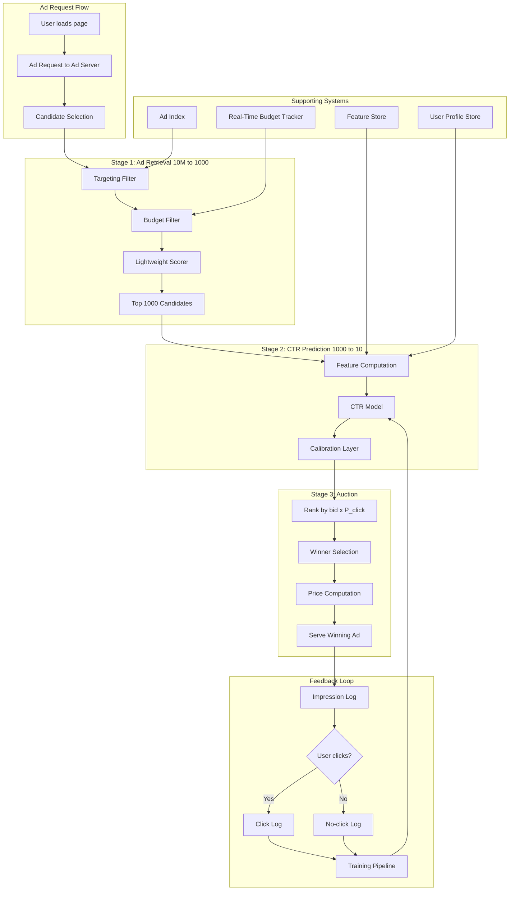

# Case Study 6: Ads Click-Through Rate Prediction

> "Design a click-through rate prediction system for an ads platform."
> — Asked at: Google, Meta, Amazon, Microsoft, Pinterest, Snapchat, Twitter/X

---

## Step 1: Problem Definition + Clarifying Questions

### What are we building?

A system that predicts the probability a user will click on a given ad. This prediction drives the ad auction: advertisers bid for ad slots, and the platform selects which ad to show based on a combination of bid amount and predicted CTR. The predicted CTR directly determines ad revenue — a 1% improvement in CTR prediction accuracy at Google or Meta translates to billions of dollars in annual revenue.

### Clarifying questions to ask the interviewer

1. **Scale**: How many ad requests per day? → Assume 100B ad impressions/day, 10M active ads
2. **Latency**: What is the decision time budget? → Under 50ms (ad auction runs before page loads)
3. **Ad format**: What types of ads? → Display ads (image + text), video ads, sponsored search results
4. **Auction type**: How does bidding work? → Second-price auction. Winner pays the second-highest bid. Platform ranks by: bid * P(click). So predicted CTR directly determines which ad wins.
5. **Feedback**: How quickly do we know if the prediction was correct? → Clicks happen within seconds. Conversions (purchases) take hours/days.
6. **Calibration**: Does the exact probability value matter or just the ranking? → Both. The probability must be calibrated because it is used in pricing. If P(click) = 0.05, then roughly 5 out of 100 impressions should result in clicks. Miscalibration means advertisers overpay or underpay.

### ML Problem Formulation

This is a **binary classification problem** with calibration requirements. The model predicts: "Given this user, this ad, and this context, what is the probability the user will click this ad?"

Key difference from other ranking problems: the predicted probability is used directly in a pricing equation, not just for ordering. This means **calibration matters as much as discrimination**. A model that ranks ads correctly but outputs P(click) = 0.5 for everything would break the auction.

### Why CTR Prediction is the Hardest ML Problem at Scale

- **Extreme scale**: 100B predictions/day. Every millisecond of latency costs revenue.
- **Sparse features**: Most feature interactions are extremely rare (specific user + specific ad + specific time = seen once)
- **Non-stationary**: Ad creatives change daily. Campaigns start and stop. User behavior shifts with seasons and events.
- **Adversarial**: Advertisers optimize their ads against your model. Click fraud inflates metrics.
- **Calibration required**: Not just ranking — the exact probability drives pricing.

---

## Step 2: Metrics

### Offline Metrics

| Metric | What It Measures | Target |
|--------|-----------------|--------|
| **Normalized Entropy (NE)** | Calibrated prediction quality relative to average CTR baseline | < 0.96 |
| **Log-loss (cross-entropy)** | How accurate are predicted probabilities? | Lower is better |
| **AUC-ROC** | Can the model separate clicks from non-clicks? | > 0.80 |
| **Calibration error** | Average absolute difference between predicted and actual CTR across buckets | < 0.005 |
| **RIG (Relative Information Gain)** | % improvement in log-loss over baseline (always-predict-average) | > 4% |

### Why NE and not just AUC?

AUC only measures ranking quality (can the model tell which ads are more clickable?). NE also measures calibration (are the predicted probabilities accurate?). In ads, calibration matters because:

- If model predicts P(click) = 0.10 but actual rate is 0.05, advertisers are charged based on inflated CTR → they overpay → they leave the platform
- If model predicts P(click) = 0.02 but actual rate is 0.05, the platform undercharges → lost revenue

### Online Metrics

| Metric | What It Measures | Why It Matters |
|--------|-----------------|----------------|
| **Revenue per thousand impressions (RPM)** | Revenue earned per 1,000 ad impressions | Primary business metric |
| **Advertiser ROI** | Revenue advertisers earn per dollar spent | Advertiser satisfaction and retention |
| **Click-through rate (actual)** | Observed click rate | Model accuracy signal |
| **Cost per click (CPC)** | Average price advertisers pay per click | Market efficiency |
| **Ad load** | % of content slots filled with ads | User experience vs revenue balance |
| **User engagement with organic content** | Does showing ads reduce engagement with non-ad content? | Long-term platform health |

### Guardrail Metrics
- User session duration (must not drop — too many ads or bad ads drive users away)
- Advertiser churn rate (must not increase)
- Ad quality score (must not degrade)
- Click fraud rate (must not increase)

---

## Step 3: High-Level Architecture

### Ad Auction Mechanics

The ad platform runs a **second-price auction** for every ad slot:

1. Each advertiser sets a bid (max price they will pay per click)
2. Platform ranks ads by: **eCPM = bid * P(click) * 1000**
3. The highest eCPM ad wins the slot
4. The winner pays the minimum bid needed to win: **price = (second_highest_eCPM / P(click))**

This means the CTR model directly determines both which ad wins and how much the winner pays. A miscalibrated model distorts the entire marketplace.

---

## Step 4: Data Pipeline + Feature Engineering

### Feature Categories

#### Ad Features (properties of the advertisement)
- **Ad creative embedding**: Image embedding (ResNet) + text embedding (BERT) of ad creative
- **Ad category**: Product/service category (e-commerce, finance, gaming, etc.)
- **Historical CTR of this ad**: Smoothed CTR from past impressions (Bayesian prior for new ads)
- **Ad age**: Days since campaign started (click fatigue — CTR drops over time)
- **Ad format**: Image, video, carousel, text-only
- **Landing page quality score**: Load speed, mobile-friendliness, relevance
- **Advertiser quality score**: Historical performance of this advertiser's campaigns

#### User Features (properties of the viewer)
- **User ad interaction history**: CTR on past ads by category (e.g., 3% CTR on e-commerce ads, 0.5% on finance ads)
- **User interest embedding**: Derived from browsing and engagement history
- **Demographics**: Age bucket, gender, location (for targeting match quality)
- **Device type**: Mobile vs desktop (CTR differs significantly)
- **Session depth**: How many pages has the user viewed this session? (ad fatigue)
- **Ad frequency**: How many times has this user seen this specific ad? (diminishing returns)

#### Context Features
- **Page type**: Homepage, search results, article page, video player
- **Ad position**: Above fold, sidebar, in-feed, interstitial
- **Time of day**: Binned into 4-hour windows
- **Day of week**: Weekend vs weekday
- **Device OS**: iOS vs Android (different user behavior)

#### Cross Features (User x Ad interactions)
- **User-ad category match**: Does this ad's category match the user's interest profile?
- **User-advertiser history**: Has this user clicked on this advertiser's ads before?
- **User-ad frequency**: Number of times this user has seen this exact ad (frequency capping)
- **Query-ad relevance**: For search ads, semantic similarity between search query and ad text

### The Feature Interaction Problem

CTR prediction is dominated by feature interactions, not individual features:

- "User is male" is weakly predictive
- "Ad is for shoes" is weakly predictive
- "Male user seeing an ad for men's running shoes" is strongly predictive

The model must learn billions of such interactions from sparse data. This is the core challenge.

---

## Step 5: Model Selection + Training Strategy

### Model Architecture: Deep & Cross Network v2 (DCN-v2)

DCN-v2 is the industry standard for CTR prediction. It combines explicit feature crossing with deep learning.

**Architecture:**
Input Features
|
[Embedding Layer: convert sparse features to dense]
|
+------+------+
|             |
[Cross Network] [Deep Network]
|             |
+------+------+
|
[Combination Layer]
|
[Sigmoid]
|
P(click)

**Cross Network**: Applies explicit polynomial feature interactions. Each cross layer computes:
x_{l+1} = x_0 * (W_l * x_l + b_l) + x_l

This efficiently models interactions like (user_age x ad_category x time_of_day) without requiring them to be manually specified. 3-4 cross layers capture interactions up to degree 4-5.

**Deep Network**: Standard MLP (1024 → 512 → 256) that captures non-linear patterns the cross network misses.

**Why DCN-v2 over alternatives?**

| Model | Pros | Cons |
|-------|------|------|
| Logistic Regression | Fast, interpretable | Cannot learn feature interactions automatically |
| GBDT (XGBoost) | Good with dense features | Slow for sparse features, hard to serve at 50ms |
| Wide & Deep | Industry proven (Google 2016) | Wide part requires manual feature engineering |
| DeepFM | Automatic feature interactions via FM | FM layer limited to 2nd-order interactions |
| **DCN-v2** | **Automatic interactions to arbitrary order, efficient** | More complex to train |

### Handling Sparse Features: Embedding Tables

Most features in ads are categorical with massive cardinality:
- User ID: 2B unique values
- Ad ID: 10M unique values
- Ad creative hash: 100M unique values

Each categorical feature is mapped to a learned embedding vector (typically 16-64 dimensions). The embedding table for User IDs alone requires 2B * 64 floats = 512GB. Solutions:

- **Feature hashing**: Hash user IDs into 10M buckets (collisions accepted, embeddings shared)
- **Compositional embeddings**: Represent each ID as a combination of sub-embeddings (reduces table size 10-100x)
- **Frequency-based pruning**: Only maintain embeddings for users/ads with >N impressions. Rare entities get a shared default embedding.

### Training Strategy

**Training data**: Every ad impression is a training example.
- Label = 1 if user clicked, 0 if not
- Average CTR ~2% (severe class imbalance)

**Negative downsampling:**
Training on all impressions would mean 98% of examples are negatives. This is wasteful. Downsample negatives to achieve a 50/50 ratio in training, then calibrate the output probabilities to correct for the sampling ratio:
P_calibrated = P_model / (P_model + (1 - P_model) * sampling_rate)

This is critical. Without calibration correction, the model would output inflated probabilities, breaking the auction.

**Online learning:**
Unlike most ML systems that retrain daily, CTR models benefit from near-real-time updates because:
- New ad campaigns launch hourly
- User interests shift with news and events
- Ad fatigue causes CTR to drop over hours/days

Approach: Train a base model offline (daily), then update embeddings online using streaming gradient descent on the latest click data. This gives the freshness of online learning with the stability of batch training.

**Training infrastructure:**
- Distributed training across hundreds of GPUs
- Petabytes of training data (30 days of impressions)
- Parameter server architecture for embedding tables (too large for single machine)
- Batch size: 10,000+ (large batches for stable gradients on sparse features)

### Calibration

After model training, apply isotonic regression calibration:
1. Bin predictions into 100 buckets by predicted probability
2. For each bucket, compute the actual CTR (observed clicks / total impressions)
3. Fit an isotonic regression (monotonic piecewise linear function) mapping predicted → actual CTR
4. Apply this calibration layer at serving time

Verify calibration with a reliability diagram: plot predicted CTR (x-axis) vs actual CTR (y-axis). A perfectly calibrated model lies on the diagonal.

---

## Step 6: Serving, Monitoring, and Trade-offs

### Serving Architecture

| Component | Latency Budget |
|-----------|---------------|
| Ad retrieval + targeting + budget filter | 10ms |
| Feature retrieval (user profile, ad features) | 8ms |
| Real-time feature computation | 5ms |
| Model inference (1000 candidates) | 15ms |
| Calibration | 1ms |
| Auction + pricing | 2ms |
| Network + serialization | 9ms |
| **Total** | **~50ms** |

Model inference must score 1,000 candidates in 15ms. This requires:
- Quantized model (INT8 inference)
- Batched inference on GPU or optimized CPU (Intel MKL)
- Model distillation (train a large teacher model, deploy a smaller student)

### Feature Freshness Requirements

| Feature Type | Freshness | Storage |
|-------------|-----------|---------|
| User profile embedding | Updated daily | Feature store (Redis) |
| Ad historical CTR | Updated hourly | Feature store |
| User-ad frequency | Updated per-impression | Real-time counter (Redis) |
| User session depth | Updated per-pageview | Session store |
| Ad budget remaining | Updated per-impression | Real-time budget tracker |

### Click Fraud Detection

Click fraud (bots or competitors clicking on ads to drain advertiser budgets) is a significant threat:

- **Detection features**: Click velocity (clicks per second from same IP), mouse movement patterns, time between impression and click, device fingerprint anomalies
- **Pre-bid filtering**: Block known bot traffic before running the auction
- **Post-click validation**: Analyze click patterns after the fact, issue refunds for invalid clicks
- **Impact on CTR model**: If fraud clicks enter training data, the model learns to predict fraud clicks, not genuine interest. Filter fraud from training data.

### Monitoring

| What to Monitor | How | Alert |
|----------------|-----|-------|
| Overall RPM | Daily trend | Drop > 5% |
| Model NE | Daily offline evaluation | Degradation > 0.5% |
| Calibration error | Hourly reliability diagram | Error > 1% |
| Prediction latency P99 | Prometheus | > 15ms |
| Feature serving latency P99 | Prometheus | > 10ms |
| CTR by ad category | Daily breakdown | Sudden shift in any category |
| Advertiser spend pacing | Real-time budget tracking | Budget exhaustion rate anomalies |
| New ad cold start performance | First-24hr CTR vs predicted | Prediction error > 50% for new ads |

### Trade-offs Discussed

| Decision | Option A | Option B | Our Choice | Why |
|----------|----------|----------|------------|-----|
| Model architecture | GBDT | Deep learning (DCN-v2) | DCN-v2 | Better at sparse feature interactions |
| Embedding size | 16-dim | 128-dim | 32-dim | Balance between expressiveness and memory |
| Training | Full batch (daily) | Online + batch (continuous) | Online + batch | Freshness critical for new campaigns |
| Negative sampling | No sampling | 50/50 with calibration | 50/50 + calibration | Training efficiency; calibration corrects bias |
| Serving | CPU | GPU | CPU with quantization | Lower cost at scale, sufficient throughput |
| Calibration | None | Isotonic regression | Isotonic | Required for correct auction pricing |

### What would you do differently at larger scale?

- **Multi-task prediction**: Predict P(click), P(conversion), P(install) simultaneously. Rank by: bid * P(click) * P(conversion|click) * conversion_value. This is called oCPM (optimized cost per mille) and is the standard at Meta.
- **Delayed feedback modeling**: Conversions (purchases) happen hours or days after clicks. The model must handle this delay — training data has missing labels for recent impressions. Solutions: importance-weighted loss, positive-unlabeled learning.
- **Auto-bidding**: Instead of advertisers setting bids manually, the platform's ML system sets optimal bids for each auction to maximize the advertiser's total conversions within their daily budget. This is a constrained optimization problem.
- **Creative optimization**: Automatically select which ad creative (image, headline, description combination) to show based on predicted CTR per creative variant. This is multi-armed bandit applied to ad creatives.
- **Privacy-preserving features**: With cookie deprecation and privacy regulations (GDPR, CCPA), user-level features become limited. Solutions: federated learning, contextual targeting (targeting based on page content instead of user history), privacy-preserving aggregation.

---

## Key Interview Talking Points

1. **Lead with the auction mechanics**. CTR prediction drives ad ranking AND pricing. This is the unique constraint that separates ads from other ranking problems.
2. **Emphasize calibration**. This is the number one differentiator. Most candidates discuss AUC but forget that ads require calibrated probabilities for correct pricing. Always mention isotonic regression or Platt scaling.
3. **Name DCN-v2** as the architecture. Explain cross layers for explicit feature interactions. This signals you understand the state of the art.
4. **Discuss negative downsampling + calibration correction**. Training on 98% negatives is wasteful. Downsampling + calibration correction is standard practice. Knowing this formula shows production experience.
5. **Mention online learning**. Ads are one of the few domains where online model updates are standard. New campaigns and creative fatigue require fresher models than daily retraining.
6. **Bring up click fraud**. This shows you think about adversarial threats in production systems.
