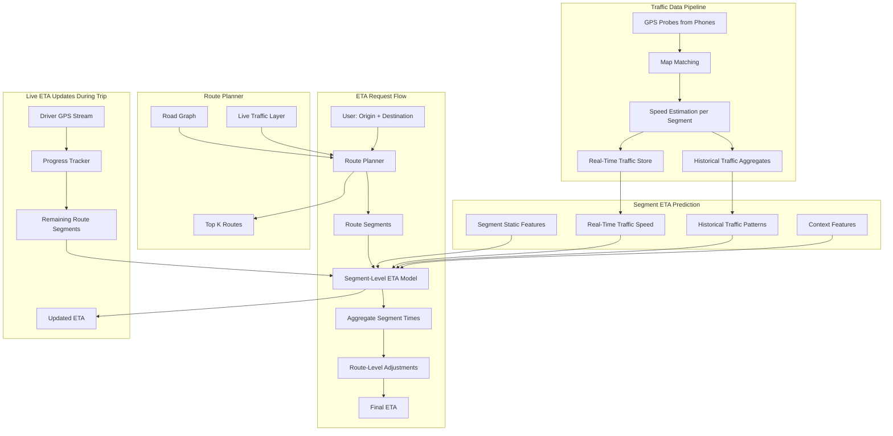

# Case Study 7: ETA Prediction (Maps)

> "Design an ETA prediction system for a maps application like Google Maps or Uber."
> — Asked at: Google, Uber, Lyft, Grab, DoorDash, Amazon (logistics)

---

## Step 1: Problem Definition + Clarifying Questions

### What are we building?

A system that predicts how long a trip will take from point A to point B. When a user requests directions or a rideshare, the system must estimate the travel time accounting for current traffic, road conditions, route segments, and historical patterns. ETA appears before the trip starts (pre-trip estimate) and updates continuously during the trip (live ETA).

### Clarifying questions to ask the interviewer

1. **Scale**: How many ETA requests per day? → Assume 1B ETA requests/day (Google Maps scale)
2. **Latency**: How fast must ETA be returned? → Under 200ms for pre-trip estimate
3. **Transport modes**: Cars only or also walking, cycling, transit? → Focus on driving, but architecture should support others
4. **Accuracy target**: What is acceptable error? → Median absolute error < 15% of actual travel time. For a 20-minute trip, prediction within +/- 3 minutes.
5. **Coverage**: Global or specific region? → Global, but accuracy varies by data density. Dense data in cities, sparse in rural areas.
6. **Live updates**: Does ETA update during the trip? → Yes, every 30 seconds based on real-time position and traffic

### ML Problem Formulation

This is a **regression problem**. The model predicts: "Given an origin, destination, departure time, and current conditions, how many seconds will this trip take?"

Key complexity: A trip consists of multiple road segments with different speed characteristics. The model must predict traversal time for each segment and aggregate across the route. This is not a single-point regression — it is structured prediction over a graph (road network).

---

## Step 2: Metrics

### Offline Metrics

| Metric | What It Measures | Target |
|--------|-----------------|--------|
| **Mean Absolute Error (MAE)** | Average absolute difference between predicted and actual trip time | < 2 minutes for trips under 30 min |
| **Mean Absolute Percentage Error (MAPE)** | Average % error relative to actual trip time | < 15% |
| **Median APE** | Median % error (robust to outliers) | < 10% |
| **P90 error** | 90th percentile absolute error | < 5 minutes for trips under 30 min |
| **Bias** | Average signed error (positive = overestimate, negative = underestimate) | Near 0 (unbiased) |

### Why both MAE and MAPE?

MAE treats all trips equally (3-minute error on a 10-minute trip and a 60-minute trip both contribute 3 minutes). MAPE normalizes by trip length (3-minute error is 30% on a 10-minute trip but 5% on a 60-minute trip). You need both because:
- MAE is more interpretable ("our average error is 2 minutes")
- MAPE is fairer across trip lengths and detects problems with short trips that MAE hides

### Online Metrics

| Metric | What It Measures | Why It Matters |
|--------|-----------------|----------------|
| **ETA accuracy on completed trips** | Actual vs predicted for real trips | Ground truth evaluation |
| **Under-prediction rate** | % of trips that take longer than predicted | Users hate arriving late; under-prediction erodes trust |
| **Over-prediction rate** | % of trips where ETA was too pessimistic | Over-predicting wastes user planning time |
| **Rider cancellation rate (rideshare)** | % of rides cancelled after seeing ETA | Inaccurate ETA → cancellations → lost revenue |
| **Driver acceptance rate (rideshare)** | % of ride requests accepted by drivers | Bad ETA → drivers reject unprofitable trips |
| **User trust score** | Survey: "How much do you trust the estimated time?" | Long-term product health |

### Guardrail Metrics
- Route selection quality (ETA model influences which route is recommended — bad ETA can cause bad routing)
- Surge pricing accuracy (at Uber/Lyft, ETA feeds into dynamic pricing — miscalibration distorts prices)

---

## Step 3: High-Level Architecture

### Why segment-level prediction?

A trip from A to B traverses multiple road segments (e.g., 2 miles on a highway, 0.5 miles on a local road, 3 traffic lights). Each segment has different characteristics:

- Highway segment: Speed depends on traffic density, speed limit is 65mph
- Local road segment: Speed depends on traffic lights, turns, school zones
- Intersection: Additional delay for traffic signals and turns

Predicting a single ETA for the entire trip misses these differences. Segment-level prediction captures the heterogeneity and aggregates it. This also enables live updates: when a driver passes segment 5, we only need to re-predict segments 6-N.

---

## Step 4: Data Pipeline + Feature Engineering

### Data Sources

| Source | Data | Volume | Latency |
|--------|------|--------|---------|
| GPS probes | Lat/long, speed, heading from phones running maps | 10B data points/day | Real-time (seconds) |
| Historical trips | Completed trip trajectories with actual travel times | 500M trips/day | Batch (daily) |
| Road network graph | Segments, intersections, speed limits, road types | Updated weekly | Batch |
| Traffic incidents | Accidents, road closures, construction | From authorities + user reports | Real-time (minutes) |
| Weather | Temperature, precipitation, visibility | From weather API | Real-time (hourly) |
| Events | Concerts, sports games, holidays | From event databases | Batch (daily) |

### GPS Probes to Traffic Speed (Data Pipeline)

The core data pipeline converts raw GPS traces into segment-level speed estimates:

1. **GPS collection**: Phones running Google Maps / Uber / Waze send anonymized (lat, long, speed, timestamp) every few seconds
2. **Map matching**: Snap GPS coordinates to the nearest road segment using Hidden Markov Model (handles GPS noise and multi-lane roads)
3. **Speed aggregation**: For each road segment, compute median speed from all probes in the last 5 minutes
4. **Coverage handling**: Segments with no recent probes use historical average speed for this time-of-day and day-of-week
5. **Storage**: Current speeds stored in a real-time key-value store (Redis), historical patterns in a time-series database

### Feature Engineering

#### Segment Static Features (do not change)
- **Road type**: Highway, arterial, residential, unpaved (one-hot)
- **Speed limit**: Posted speed limit in km/h
- **Number of lanes**: More lanes = higher capacity
- **Segment length**: Distance in meters
- **Is bridge/tunnel**: Different driving dynamics
- **Number of traffic lights on segment**: Each light adds expected delay
- **Turn angle at segment end**: Sharp turns slow vehicles down
- **Elevation change**: Uphill segments are slower for trucks
- **One-way vs two-way**: Traffic flow patterns differ

#### Real-Time Traffic Features (change every few minutes)
- **Current median speed**: From GPS probes in the last 5 minutes
- **Speed ratio**: Current speed / free-flow speed (1.0 = no congestion, 0.3 = heavy traffic)
- **Speed trend**: Is traffic getting faster or slower? (derivative of speed over last 15 minutes)
- **Upstream congestion**: Is the next segment congested? (propagation prediction)
- **Incident nearby**: Is there an accident within 1km of this segment?

#### Historical Traffic Features (learned patterns)
- **Historical median speed**: For this segment, at this hour, on this day of week (from last 8 weeks)
- **Historical speed variance**: How predictable is this segment? (high variance = harder to predict)
- **Holiday/event adjustment**: Historical speed during past similar events
- **Seasonal pattern**: Summer vs winter speeds (relevant in northern climates)

#### Trip-Level Features (computed for the overall route)
- **Total distance**: Sum of all segment lengths
- **Number of segments**: Route complexity
- **Number of highway-to-local transitions**: Merging/exiting adds delay
- **Number of left turns**: Left turns at intersections take longer than right turns (in right-hand-drive countries)
- **Trip start time**: Hour of day (rush hour vs off-peak)
- **Day of week**: Tuesday 8am vs Sunday 8am have very different traffic

#### Context Features
- **Weather**: Rain reduces speeds by 10-15%, snow by 30-40%
- **Visibility**: Fog, night driving
- **Special events**: Stadium nearby with game ending in 30 minutes
- **School zones**: Active during school hours, inactive otherwise

### Intersection Delay Model

Intersections require a separate delay model because time spent at a traffic light is not captured by segment speed:

- **Signal timing**: If known, estimate expected wait (average half the cycle length)
- **Turn type**: Through, right turn, left turn (different delays)
- **Historical delay**: Average delay at this intersection by time of day
- **Queue length estimate**: From upstream probe density

---

## Step 5: Model Selection + Training Strategy

### Two-Level Model Architecture

#### Level 1: Segment Traversal Time Model

**Model: Gradient Boosted Trees (LightGBM)**

For each road segment, predict the traversal time in seconds.

**Why LightGBM?**
- Handles mixed feature types (numeric + categorical) without preprocessing
- Fast inference (critical — must score hundreds of segments per request)
- Naturally captures non-linear relationships (speed limit has diminishing returns, congestion effects are non-linear)
- Feature importance is interpretable (useful for debugging)

**Training data:**
- Extract segment traversal times from completed GPS traces
- Each (segment_id, timestamp, features) → actual traversal time
- Billions of training examples from historical trips
- Retrain daily with the latest data

**Features → Prediction flow:**
Input: segment features (static + real-time + historical)
→ LightGBM
→ Predicted traversal time (seconds)

#### Level 2: Route-Level Adjustment Model

After summing segment times, apply a route-level correction that captures effects not modeled at the segment level:

- **Segment transition delays**: Time lost changing lanes, merging, decelerating between segments
- **Systematic bias correction**: If the segment model consistently under-predicts 20-minute trips by 8%, learn this correction
- **Trip-length correction**: Long trips accumulate small per-segment errors. The correction model learns to adjust based on total trip length.

**Model: Linear regression or light MLP**
Input: sum of segment times, number of segments, total distance,
number of turns, number of highway transitions
→ Correction model
→ Adjusted ETA = sum_of_segments * correction_factor + offset

### Alternative: Graph Neural Network (Advanced)

For teams with more resources, a GNN on the road network graph captures spatial dependencies:

- **Nodes**: Road segments (features: speed, road type, capacity)
- **Edges**: Connectivity (features: turn type, transition delay)
- **Message passing**: Each segment's predicted time is influenced by neighboring segments (congestion propagates through the graph)
- **Advantage**: Captures traffic propagation (if segment A is congested, segment B downstream will likely become congested in 10 minutes)
- **Disadvantage**: Expensive to train and serve. GNN inference on a large graph is slow.

In practice, the GNN approach is used at Google Maps but is replaced by simpler models at smaller companies due to infrastructure requirements.

### Uncertainty Estimation

Point estimates ("ETA: 23 minutes") are insufficient. Users need confidence ranges ("23-28 minutes").

**Approaches:**
- **Quantile regression**: Train separate models for the 10th, 50th, and 90th percentile of travel time. Output: "likely 20-28 minutes, most likely 23 minutes."
- **Distributional prediction**: Predict the parameters of a distribution (e.g., log-normal with mean and variance). More principled but harder to train.
- **Ensemble variance**: Train multiple models and use prediction variance as uncertainty.

Quantile regression is the most practical:
Model predicts: [P10: 20 min, P50: 23 min, P90: 28 min]
Displayed to user: "23 min (20-28 min range)"

---

## Step 6: Serving, Monitoring, and Trade-offs

### Serving Architecture

| Component | Latency Budget |
|-----------|---------------|
| Route planning (graph search, top-K routes) | 80ms |
| Feature retrieval per segment (batch from Redis) | 20ms |
| Segment ETA model (score all segments in batch) | 30ms |
| Route-level adjustment | 5ms |
| Response formatting | 5ms |
| Network + serialization | 10ms |
| **Total** | **~150ms** (within 200ms budget) |

Key optimization: Score all segments in a single batched model call rather than one call per segment. A route with 100 segments becomes a single batch inference with 100 rows.

### Live ETA Updates

During a trip, ETA must update every 30 seconds:

1. **Track progress**: Match driver GPS to current segment on route
2. **Compute remaining**: Only re-predict segments ahead of the driver
3. **Detect deviations**: If driver leaves the planned route, re-route and recalculate
4. **Incorporate real-time changes**: Traffic conditions may have changed since the trip started

Live updates are cheaper because:
- Fewer segments to predict (only remaining, not full route)
- No route planning needed (route already selected)
- Latency budget is relaxed (update interval is 30s, not user-facing page load)

### Handling Difficult Scenarios

| Scenario | Challenge | Solution |
|----------|-----------|----------|
| **Road closure** | Route becomes invalid mid-trip | Re-route trigger + ETA recalculation |
| **Accident ahead** | ETA needs to increase suddenly | Real-time incident feed updates traffic speeds within 2 minutes |
| **No GPS probes** | Rural road with no recent data | Fall back to historical patterns + speed limit heuristic |
| **New road** | Road not in the graph | Weekly graph updates; temporary exclusion until mapped |
| **Weather change** | Rain starts during trip | Weather feature updated hourly; correction applied to remaining segments |
| **Extreme congestion** | Complete gridlock (speed near 0) | Cap minimum speed at walking speed; flag as "traffic conditions unusual" |

### Monitoring

| What to Monitor | How | Alert |
|----------------|-----|-------|
| MAPE on completed trips | Daily aggregation of actual vs predicted | MAPE > 18% |
| Under-prediction rate | % of trips arriving later than predicted | > 35% |
| Bias by trip length | Mean signed error for short/medium/long trips | Bias > +/- 2 minutes |
| Bias by geography | MAPE per city/region | Any region MAPE > 25% |
| Traffic data freshness | Age of latest GPS probes per segment | > 10 minutes in urban areas |
| Model latency P99 | Prometheus | > 30ms per batch |
| Route planner latency P99 | Prometheus | > 100ms |
| Live ETA update accuracy | Compare live updates to actual remaining time | Increasing error during trip |

### Trade-offs Discussed

| Decision | Option A | Option B | Our Choice | Why |
|----------|----------|----------|------------|-----|
| Prediction granularity | Whole-trip prediction | Segment-level | Segment-level | More accurate, enables live updates |
| Segment model | Linear regression | LightGBM | LightGBM | Captures non-linear traffic patterns |
| Traffic data | Speed cameras only | GPS probes | GPS probes | Orders of magnitude more data, better coverage |
| Uncertainty | Point estimate only | Quantile range | Quantile range | Users and downstream systems need confidence intervals |
| Live updates | Every 60 seconds | Every 30 seconds | Every 30 seconds | Better user experience, minimal compute cost |
| Graph approach | Independent segments | GNN (spatially-aware) | Independent + route correction | GNN accuracy gain does not justify infrastructure cost unless at Google scale |

### What would you do differently at larger scale?

- **Spatio-temporal GNN**: Model the road network as a dynamic graph where node features (speeds) evolve over time. This captures both spatial dependencies (congestion propagation) and temporal dependencies (rush hour onset). DeepMind's work with Google Maps uses this approach.
- **Multi-modal ETA**: Predict ETA for walking + transit + rideshare simultaneously and recommend the optimal combination. Walking to a bus stop (5 min) + bus (15 min) + walking (3 min) = 23 min total vs driving 20 min but parking 10 min.
- **Predictive traffic**: Instead of using current traffic, predict what traffic will look like when the driver reaches each segment (traffic forecasting). A trip starting now on a highway that is currently clear but will be congested in 15 minutes when the driver reaches it needs a different ETA.
- **Personalized ETA**: Adjust for driving style. Aggressive drivers consistently arrive faster than predicted; cautious drivers consistently arrive slower. Learn a per-driver calibration factor.
- **Simulation-based ETA**: For complex scenarios (construction zones, special events), run a traffic microsimulation to predict conditions rather than relying on pattern matching from historical data.

---

## Key Interview Talking Points

1. **Start with segment-level prediction**. This is the core architectural insight. Whole-trip prediction is a red flag answer.
2. **Explain the GPS probe pipeline**. Raw GPS → map matching → segment speed. This shows you understand the data infrastructure, not just the model.
3. **Mention the route-level correction**. Summing segment times is not enough — systematic biases and transition delays require a second-level model.
4. **Discuss uncertainty estimation**. Quantile regression for confidence intervals. "23 minutes (20-28 min range)" is far more useful than a point estimate.
5. **Bring up live ETA updates**. The system is not just pre-trip. Continuous updates during the trip are critical for user trust and rideshare operations.
6. **Mention traffic propagation**. Congestion on segment A predicts future congestion on downstream segment B. Whether you model this via GNN or simpler features, acknowledging it shows depth.
CASEEOFcat > case-studies/07-eta-prediction.md << 'CASEEOF'
