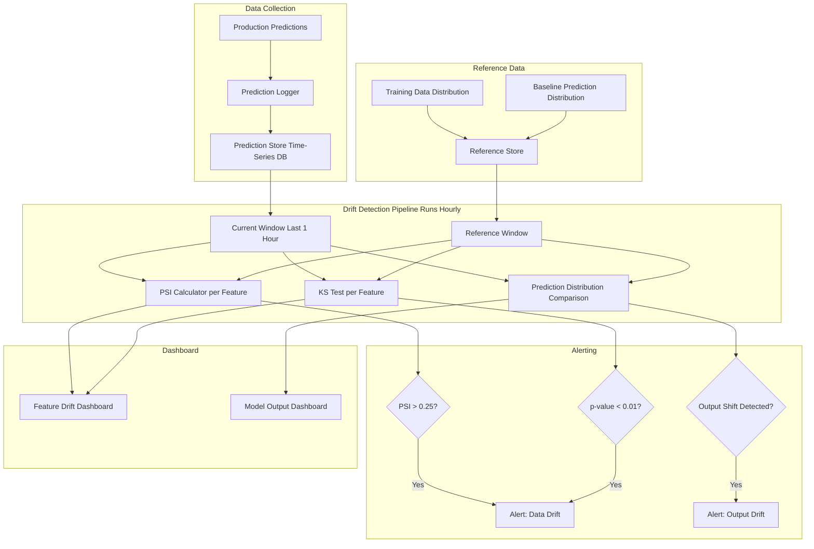
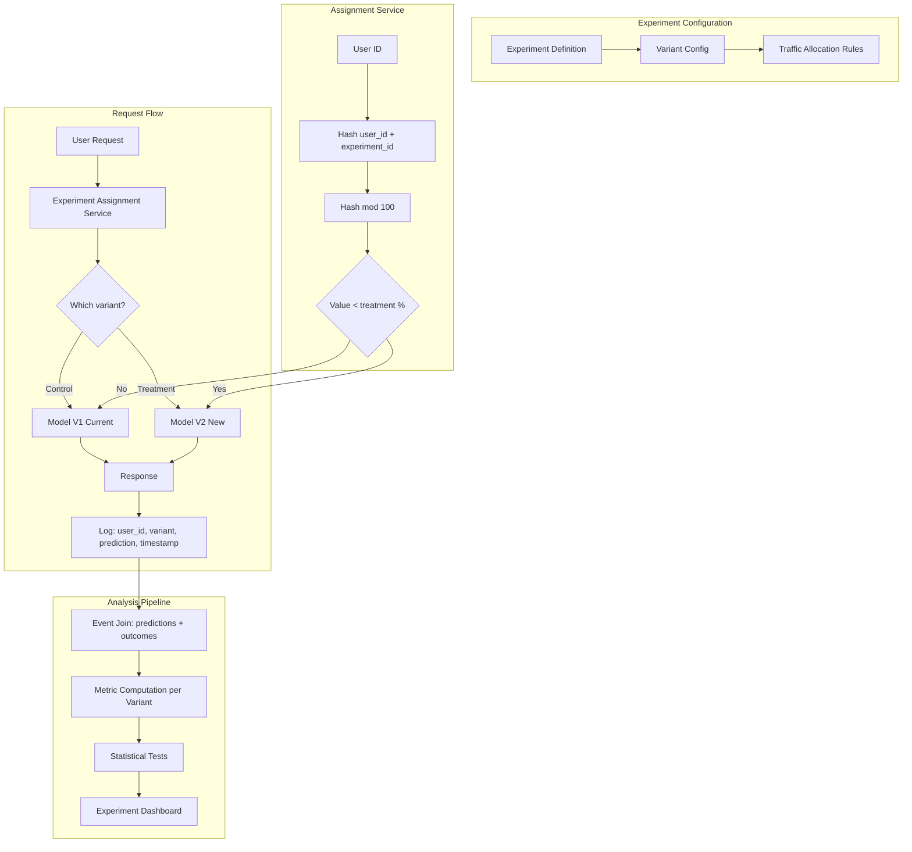

# Case Study 8: Model Monitoring & A/B Testing Framework

> "Design a system to monitor ML models in production and run A/B tests for new model versions."
> — Asked at: All major tech companies (Meta, Google, Amazon, Netflix, Uber, Airbnb)

---

## Step 1: Problem Definition + Clarifying Questions

### What are we building?

A platform that solves two connected problems:

1. **Model Monitoring**: Continuously track the health and performance of ML models deployed in production. Detect when models degrade before they cause business damage.

2. **A/B Testing (Experimentation)**: When a new model version is ready, test it against the current production model on live traffic to measure real-world impact before full deployment.

These two systems are tightly connected: monitoring tells you when a model is broken, and A/B testing tells you whether a replacement model is actually better.

### Clarifying questions to ask the interviewer

1. **Scale**: How many models in production? → Assume 50-200 ML models across the company (recommendation, search, ads, fraud, content moderation, etc.)
2. **Frequency**: How often are new model versions deployed? → Each model team ships 1-2 new versions per month
3. **Traffic volume**: How many predictions per day across all models? → 10B+ predictions/day
4. **Detection speed**: How fast must we detect model degradation? → Within 1 hour for critical models (ads, fraud), within 24 hours for others
5. **Experimentation volume**: How many concurrent A/B tests? → 50-100 concurrent experiments across all models
6. **Decision criteria**: Who decides whether to ship a new model? → Data from A/B test + review by model owner + approval from a review committee

### ML Problem Formulation

This is not a single ML problem — it is an infrastructure system that serves all ML models. The core technical challenges are:

- **Drift detection**: Statistical methods to detect when input distributions or model outputs shift
- **Performance estimation**: Estimating model accuracy in production when ground truth labels are delayed or unavailable
- **Experiment design**: Correctly splitting users, computing sample sizes, and avoiding statistical errors in A/B tests
- **Causal inference**: Determining whether observed metric changes are caused by the new model or by external factors

---

## Step 2: What to Monitor (The Four Levels)

### Level 1: Infrastructure Monitoring

This is not ML-specific but is the foundation. If the serving infrastructure is down, nothing else matters.

| Metric | What It Tracks | Alert Threshold |
|--------|---------------|-----------------|
| Prediction latency P50/P95/P99 | Response time distribution | P99 > SLA (e.g., 100ms) |
| Request throughput | Predictions per second | Drop > 20% from expected |
| Error rate | % of requests returning errors (5xx) | > 0.1% |
| CPU/Memory/GPU utilization | Resource consumption | > 85% sustained |
| Model load time | Time to load model into memory on startup | > 30 seconds |
| Dependency health | Feature store, database, upstream services | Any dependency down |

### Level 2: Data Quality Monitoring

Catch problems in the input data before they corrupt model predictions.

| Check | What It Detects | Method |
|-------|----------------|--------|
| **Missing features** | Feature computation pipeline broken | Count nulls per feature per hour; alert if > 1% |
| **Feature distribution shift** | Input data has changed from training | KS test or PSI comparing current vs training distribution |
| **Schema violations** | Wrong data types, out-of-range values | Validate against expected schema |
| **Feature staleness** | Feature store returning outdated values | Track timestamp of latest feature update |
| **Volume anomaly** | Sudden spike or drop in prediction requests | Compare hourly volume to expected (time-series anomaly detection) |

### Level 3: Model Output Monitoring

Track what the model is predicting, even before knowing if predictions are correct.

| Metric | What It Detects | Method |
|--------|----------------|--------|
| **Prediction distribution shift** | Model outputs have changed | Compare distribution of P(y) current vs baseline |
| **Prediction mean/variance** | Systematic bias changes | Track rolling mean and variance of predictions |
| **Class balance shift** | Model predicts one class much more/less than expected | Track % positive predictions vs expected rate |
| **Confidence distribution** | Model becoming less certain | Histogram of prediction probabilities; shift toward 0.5 = less confident |
| **Outlier predictions** | Individual predictions that are extreme | Flag predictions > 3 standard deviations from mean |

### Level 4: Performance Monitoring

Track actual model accuracy using ground truth labels.

| Metric | Challenge | Solution |
|--------|-----------|----------|
| **Accuracy / AUC / F1** | Need labels to compute | Collect labels as they arrive (clicks, purchases, chargebacks) |
| **Delayed labels** | Fraud labels take 30-90 days | Use proxy metrics (manual review decisions) until real labels arrive |
| **Partial labels** | Only know labels for positive outcomes (user clicked) not negative (user saw but did not click — was the item actually irrelevant?) | Use counterfactual estimation or randomization data |
| **Business metrics** | Revenue, conversion, engagement | Correlate model metric changes with business metric changes |

---

## Step 3: Drift Detection (Theory + Implementation)

### What is Drift?

Drift means the statistical properties of the data have changed from what the model was trained on.

| Type | What Changes | Example | Impact |
|------|-------------|---------|--------|
| **Data drift (covariate shift)** | Input feature distributions change | Users shift from desktop to mobile; age distribution changes | Model sees inputs it was not trained on; predictions become unreliable |
| **Concept drift** | Relationship between features and target changes | Economic recession changes what predicts customer churn | Model learned the wrong patterns; accuracy drops |
| **Label drift** | Target distribution changes | Fraud rate increases from 0.1% to 0.5% due to new attack vector | Model calibration is wrong; thresholds need adjustment |
| **Upstream drift** | Data pipeline changes how features are computed | Feature store bug returns stale data | Model receives corrupted inputs |

### Detection Methods

#### Population Stability Index (PSI)

PSI measures how much a feature distribution has shifted from a reference (training) distribution.
PSI = Sum over bins: (Actual% - Expected%) * ln(Actual% / Expected%)

Interpretation:
- PSI < 0.1: No significant shift
- 0.1 < PSI < 0.25: Moderate shift — investigate
- PSI > 0.25: Significant shift — action required

Advantages: Simple, interpretable, works for any feature type (bin continuous features). Widely used in regulated industries (banking, insurance).

#### Kolmogorov-Smirnov (KS) Test

KS test computes the maximum difference between two cumulative distribution functions. It returns a test statistic (D) and a p-value.

- p-value < 0.05: Distributions are statistically different
- Works well for continuous features
- Sensitive to both location and shape changes

#### Wasserstein Distance (Earth Mover's Distance)

Measures the minimum "work" needed to transform one distribution into another. Unlike KS test, it quantifies how much the distributions differ, not just whether they differ.

Useful for tracking drift magnitude over time: a dashboard showing Wasserstein distance trending upward indicates gradual drift that may not trigger KS alerts until it is too late.

### Implementation Architecture

### Practical Drift Monitoring Strategy

Not every feature needs equal monitoring. Prioritize based on feature importance:

1. **Tier 1 (top 10 features by importance)**: Monitor hourly with PSI + KS test. Alert immediately on shift.
2. **Tier 2 (next 20 features)**: Monitor daily with PSI. Alert if PSI > 0.25.
3. **Tier 3 (remaining features)**: Monitor weekly. Alert only on extreme shifts (PSI > 0.5).

This tiered approach prevents alert fatigue. Monitoring 200 features hourly would generate constant false alarms.

---

## Step 4: A/B Testing Framework (Theory + Implementation)

### Theory: Why A/B Testing is Necessary

Offline metrics (AUC, NDCG, etc.) are necessary but not sufficient. A model with better AUC does not always improve business metrics because:

- **Offline/online metric gap**: The test set may not represent production traffic
- **User behavior effects**: Users interact differently with a new ranking, which changes the system dynamics
- **Confounding factors**: External events (holidays, news, competitor actions) affect metrics independently of the model

A/B testing is the gold standard for causal inference: it isolates the effect of the new model by comparing it against the existing model on randomized user groups.

### Experiment Design

#### Randomization Unit

| Unit | Pros | Cons | When to Use |
|------|------|------|-------------|
| **User-level** | Consistent experience per user; avoids confusion | Slower to reach significance; user-level variance is high | Most ML experiments (recommendation, feed, search) |
| **Request-level** | Faster to reach significance; more data points | Same user sees different models across requests — inconsistent UX | Low-visibility changes (ad ranking, backend models) |
| **Session-level** | Consistent within session, but can test more variants | Moderate variance | Session-dependent features (search session optimization) |

User-level randomization is the default for most ML experiments.

#### Traffic Allocation
Total User Base: 100%
|
+-- Control (current model): 50%
|
+-- Treatment (new model): 50%

For risky changes, start with a smaller treatment group:
- Phase 1: 5% treatment (detect catastrophic regressions)
- Phase 2: 20% treatment (gather enough data for statistical significance)
- Phase 3: 50/50 (final comparison with full statistical power)

#### Sample Size Calculation

Before starting an experiment, calculate how many users and how long you need:
Required sample size per group = (Z_alpha/2 + Z_beta)^2 * 2 * variance / MDE^2

Where:
- Z_alpha/2 = 1.96 for 95% confidence (alpha = 0.05)
- Z_beta = 0.84 for 80% power (beta = 0.20)
- variance = estimated variance of the metric
- MDE = Minimum Detectable Effect (smallest improvement you care about)

Example: To detect a 1% improvement in CTR (from 2.0% to 2.02%) with 95% confidence and 80% power, you need approximately 1.5M users per group. At 1M DAU, this takes 3 days of data collection.

### A/B Test Architecture

#### Experiment Assignment Service

The assignment must be:
- **Deterministic**: Same user always gets the same variant (hash-based, not random). This ensures consistent experience.
- **Uniform**: Users are split evenly across variants (hash function produces uniform distribution).
- **Independent across experiments**: User's assignment in experiment A does not affect their assignment in experiment B. Use different hash salts per experiment.
variant = hash(user_id + experiment_salt) % 100
if variant < treatment_percentage:
return "treatment"
else:
return "control"

### Statistical Analysis

#### Hypothesis Testing

For each metric, test:
- **H0 (null hypothesis)**: Treatment has no effect (mean_treatment = mean_control)
- **H1 (alternative)**: Treatment has an effect (mean_treatment != mean_control)

Use a two-sided t-test for continuous metrics (revenue, session duration) and a chi-squared test or z-test for proportions (CTR, conversion rate).

#### Multiple Testing Correction

When testing 10+ metrics simultaneously, some will show "significant" results by chance (at 95% confidence, 1 in 20 metrics will be false positive).

Solutions:
- **Bonferroni correction**: Divide alpha by the number of tests. If testing 10 metrics, use alpha = 0.005 instead of 0.05. Conservative but safe.
- **Benjamini-Hochberg**: Controls the false discovery rate (FDR) instead of family-wise error rate. Less conservative, allows more discoveries.
- **Pre-registered primary metric**: Designate one metric as the primary decision metric before the experiment starts. Other metrics are exploratory and do not drive the ship/no-ship decision.

#### Sequential Testing

Traditional A/B tests require a fixed sample size determined before the experiment. You cannot peek at results early and stop the test when you see significance (peeking inflates false positive rate).

Sequential testing methods allow continuous monitoring:
- **CUSUM (Cumulative Sum)**: Monitors cumulative difference between variants. Stops early if the difference is large enough.
- **Always-valid p-values**: Adjusted p-values that remain valid regardless of when you check. Used at Netflix and Spotify.
- **Bayesian approach**: Compute P(treatment is better) continuously. Stop when probability exceeds a threshold (e.g., 95%). No fixed sample size needed.

### Guardrail Metrics

Guardrails are metrics that must not degrade, regardless of the primary metric's improvement:

| Guardrail | Why It Matters |
|-----------|---------------|
| Revenue | New recommendation model must not reduce revenue |
| Latency P99 | New model must not be slower |
| Error rate | New model must not increase errors |
| User retention (7-day) | Short-term engagement lift must not come at the cost of long-term retention |
| Safety metrics | Content moderation model must not increase harmful content prevalence |

If any guardrail is violated, the experiment is blocked from shipping regardless of primary metric improvement.

---

## Step 5: End-to-End Workflow

### Model Deployment Workflow
Step 1: Offline Development

Train new model version
Evaluate on offline metrics (AUC, NDCG, etc.)
Pass offline quality bar → proceed

Step 2: Shadow Mode (Optional)

Deploy new model alongside production model
Both models score every request
Only production model's predictions are served to users
Compare predictions to detect unexpected behavior
Duration: 1-3 days

Step 3: A/B Test (Required)

Phase 1: 5% treatment (1-2 days, detect regressions)
Phase 2: 50% treatment (7-14 days, measure impact)
Monitor primary metrics + guardrails daily
If guardrails violated → auto-rollback

Step 4: Ship Decision

Primary metric statistically significant improvement?
All guardrails clean?
Model owner review + approval?
→ Full rollout to 100%

Step 5: Post-Launch Monitoring

Continue monitoring all metrics for 2 weeks
Watch for delayed effects (user behavior adaptation)
New model becomes the baseline for future experiments

### Shadow Mode Explained

Shadow mode (also called dark launch) is a risk-free way to test a new model in production without affecting users:

- Both models run on every request
- The production model's prediction is returned to the user
- The shadow model's prediction is logged but discarded
- After a few days, compare: do the two models agree? Where do they disagree? Are disagreements expected based on offline analysis?

This catches production-specific bugs (feature computation differences, serialization issues, latency problems) before any user is affected.

---

## Step 6: Common Pitfalls and Trade-offs

### A/B Testing Pitfalls

| Pitfall | What Goes Wrong | Prevention |
|---------|----------------|------------|
| **Peeking** | Checking results early and stopping when "significant" → inflated false positive rate | Use sequential testing methods or commit to fixed duration |
| **Novelty effect** | Users engage more with new experiences simply because they are new, not because they are better | Run experiments for at least 2 weeks to let novelty wear off |
| **Survivorship bias** | Only analyzing users who completed the flow, ignoring those who dropped off | Include all assigned users in analysis, not just those who engaged |
| **Simpson's paradox** | Metric improves overall but degrades for important subgroups | Segment analysis by key user groups (new vs returning, mobile vs desktop) |
| **Interference** | Treatment affects control group (e.g., social network effects — treated user shares content with control user) | Use cluster randomization (randomize by geographic region or social cluster) |
| **Metric gaming** | Optimizing the experiment metric in ways that hurt unmeasured dimensions | Comprehensive guardrail metrics + qualitative user research |

### Monitoring Pitfalls

| Pitfall | What Goes Wrong | Prevention |
|---------|----------------|------------|
| **Alert fatigue** | Too many alerts → team ignores all of them | Tiered monitoring, severity levels, alert routing |
| **Monitoring the wrong thing** | Tracking model accuracy but missing data pipeline failure | Monitor at all four levels (infra, data, output, performance) |
| **Delayed detection** | Daily monitoring misses problems that develop within hours | Critical models get hourly monitoring; others daily |
| **False attribution** | Model metrics dropped → blame the model, but actually a feature pipeline broke | Root cause analysis: always check data quality before blaming the model |
| **Missing baseline** | Cannot tell if current metrics are normal without a reference | Establish baselines before deploying monitoring |

### Trade-offs Discussed

| Decision | Option A | Option B | Our Choice | Why |
|----------|----------|----------|------------|-----|
| Drift detection method | PSI only | PSI + KS + Wasserstein | PSI + KS for top features | Balance between coverage and complexity |
| Monitoring frequency | Daily | Hourly | Tiered: hourly for critical, daily for others | Alert fatigue prevention |
| Experiment assignment | Request-level | User-level | User-level | Consistent user experience |
| Statistical test | Frequentist (t-test) | Bayesian | Frequentist + sequential testing | Industry standard; sequential allows early stopping |
| Shadow mode | Skip, go straight to A/B | Always shadow first | Shadow for major changes, skip for minor | Risk-proportionate |
| Experiment duration | Until significance | Fixed 2 weeks minimum | Fixed minimum + significance | Accounts for novelty effects and weekly cycles |

### What would you do differently at larger scale?

- **Automated experiment analysis**: At Meta's scale (1,000+ concurrent experiments), human review of every experiment is impossible. Build an automated analysis pipeline that computes metrics, runs statistical tests, checks guardrails, and produces a recommendation (ship/iterate/kill) with a confidence level.
- **Interaction detection**: When 100 experiments run simultaneously, they can interact (experiment A changes user behavior in a way that affects experiment B's metrics). Detect interactions by tracking metric correlations across experiments.
- **Counterfactual evaluation**: Before running a live A/B test, estimate the new model's impact using offline counterfactual methods (inverse propensity scoring, doubly robust estimation). This filters out models that are unlikely to win, saving live experiment capacity.
- **Automated rollback**: If a guardrail metric crosses a threshold during an A/B test, automatically roll back to the control model without human intervention. Critical for models that affect revenue or safety.
- **Feature-level monitoring**: Instead of monitoring drift per model, monitor drift per feature across all models that use it. One feature pipeline failure can break 10 models simultaneously — catching it at the feature level is faster.

---

## Key Interview Talking Points

1. **Frame monitoring as four levels**: Infrastructure → data quality → model output → model performance. This structure shows comprehensive thinking.
2. **Name specific drift detection methods**: PSI, KS test, Wasserstein distance. Know when each is appropriate and how to interpret results.
3. **Distinguish data drift from concept drift**. Data drift = inputs changed. Concept drift = the relationship between inputs and outputs changed. Different causes, different solutions.
4. **Explain why A/B testing is necessary even with good offline metrics**. The offline/online gap is real. Give examples of models that improved AUC but hurt business metrics.
5. **Discuss multiple testing correction**. If you test 20 metrics, some will be "significant" by chance. Mention Bonferroni or pre-registered primary metrics.
6. **Mention guardrail metrics**. Showing that you protect against regressions — not just optimize for gains — demonstrates production maturity.
7. **Bring up sequential testing**. The peeking problem is a common interview gotcha. Explaining always-valid p-values or Bayesian stopping rules shows statistical sophistication.
